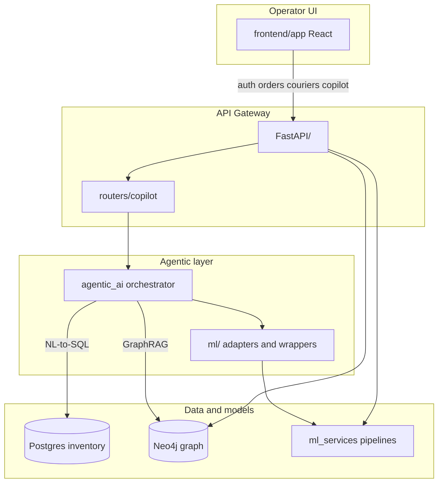

# IntelliSupply Architecture

High-level map of how components connect. For setup and commands, see [README.md](README.md).

## Data flow

## Where to look

| Concern | Location |
|---------|----------|
| Unified HTTP API | [`FastAPI/`](FastAPI/) — `/route`, `/demand`, `/eta`, `/copilot`, auth, orders |
| LangGraph orchestrator | [`agentic_ai/orchestrator/`](agentic_ai/orchestrator/) |
| ML adapter layer (orchestrator) | [`ml/`](ml/) |
| Route ranker + dispatch pipeline | [`ml_services/route_prediction/`](ml_services/route_prediction/) |
| Demand model (HF Space) | [`models/`](models/) — `hf_client.py`, `hf_space/`, `lade_demand_forecaster.pkl` |
| ETA model | [`ml_services/eta-prediction/`](ml_services/eta-prediction/) |
| Inventory NL-to-SQL | [`rag/inventory/chatbot/`](rag/inventory/chatbot/) |
| Neo4j ETL + GraphRAG | [`rag/graphdb/`](rag/graphdb/) |
| Neo4j runtime (orders, auth) | [`rag/aura_graphdb/`](rag/aura_graphdb/) |
| Trained ML artifacts | [`models/`](models/) — route, ETA pkls; demand HF bundle |
| Shared paths and env | [`config/`](config/) |
| Frontend | [`frontend/app/`](frontend/app/) |

## Design notes

- **Ranker vs router:** the LightGBM ranker picks visit order; OSRM/AMap (optional) draws driving paths between stops.
- **Two ML paths in agents:** orchestrator uses `ml/ml_executor.py`; tool-calling agents use `agentic_ai/integrations/ml_bridge.py` → `FastAPI/services/`.
- **Single env file:** all services read [`/.env`](.env.example) via [`config/env.py`](config/env.py).
