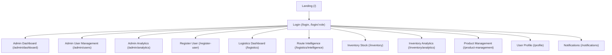
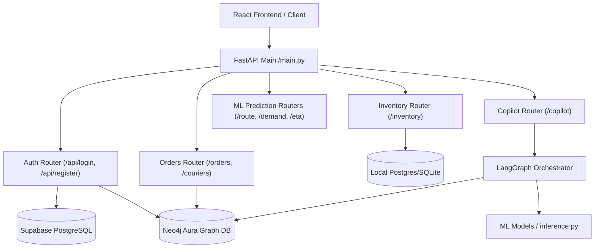

# ARCHITECTURE MAP: INTELLISUPPLY PLATFORM

This document maps the architectural landscape of the IntelliSupply enterprise AI logistics platform, detailing frontend and backend structures, routing schemes, and data flows.

---

## 1. FRONTEND ARCHITECTURE MAP

The IntelliSupply frontend is built on **React** with **TypeScript**, powered by the **Vite** bundler and styled using **Tailwind CSS**. It uses **React Router (v6/v7)** for page navigation and routing.

### 1.1 Page & Route Hierarchy
Routes are defined in [App.tsx](file:///c:/Users/Relanto/Desktop/IntelliSupply/frontend/app/src/App.tsx) and managed by the `AuthProvider` defined in [auth.tsx](file:///c:/Users/Relanto/Desktop/IntelliSupply/frontend/app/src/lib/auth.tsx).

| Route | Page Component | Allowed Roles | Description |
| :--- | :--- | :--- | :--- |
| `/` | `Landing` | *Public* | Platform welcome page. |
| `/login` | `Login` | *Public* | Username/password login form. Supports route param `/login/:role`. |
| `/admin/dashboard` | `Overview` | `admin` | Platform overview stats, active session metrics. |
| `/admin/users` | `AdminUsers` | `admin` | Management view listing all profiles and couriers. |
| `/admin/analytics` | `AdminAnalytics` | `admin` | Aggregated metrics for logistics, inventory, and system status. |
| `/register-user` | `RegisterUser` | `admin` | Form to register logistics/inventory managers in the DB. |
| `/logistics` | `LogisticsDashboard` | `admin`, `logistics_manager`, `courier` | Shipment listings, courier creation, map visualization, and Copilot sidebar. |
| `/logistics/intelligence` | `RouteIntelligence` | `admin`, `logistics_manager`, `courier` | Interactive route sequencing and next stop prediction map. |
| `/inventory` | `Inventory` | `admin`, `inventory_manager` | Inventory table with category searches and CRUD operations. |
| `/inventory/analytics` | `InventoryAnalytics` | `admin`, `inventory_manager` | Forecast trends, stockout risks, and supplier summaries. |
| `/product-management` | `ProductManagement` | `admin`, `inventory_manager` | Management form to add/edit products, stock, and thresholds. |
| `/profile` | `Profile` | *All authenticated* | View and edit user details (name). |
| `/notifications` | `Notifications` | `admin`, `logistics_manager`, `inventory_manager` | Operational alerts list filtered by role. |

### 1.2 Route Guards & Auth Provider
- **Auth Provider**: [auth.tsx](file:///c:/Users/Relanto/Desktop/IntelliSupply/frontend/app/src/lib/auth.tsx) holds the core authentication state (`user`, `loading`), registers standard login, profile patching, and logout functions, and exposes them via the `useAuth` hook.
- **Route Guards**: [ProtectedRoute.tsx](file:///c:/Users/Relanto/Desktop/IntelliSupply/frontend/app/src/components/ProtectedRoute.tsx) intercepts unauthorized navigation:
  - If loading state is active, it renders `Loading...`.
  - If no user is logged in, it redirects to `/login`, preserving the origin path in `location.state`.
  - If the user's role is not within `allowedRoles`, it checks `ROLE_HOME` to redirect them to their landing page or displays an "Access restricted" card.

### 1.3 Shared Layout & Global Components
- **Navbar**: [Navbar.tsx](file:///c:/Users/Relanto/Desktop/IntelliSupply/frontend/app/src/components/Navbar.tsx) handles context-aware navigation tabs, notifications count, and logouts.
- **AI Copilot Sidebar**: [AICopilot.tsx](file:///c:/Users/Relanto/Desktop/IntelliSupply/frontend/app/src/components/AICopilot.tsx) provides a floating chat window that sends queries to `/copilot/query` and manages multi-turn conversation states (`logisticsSession`, `inventorySession`).
- **Interactive Map**: [RouteMap.tsx](file:///c:/Users/Relanto/Desktop/IntelliSupply/frontend/app/src/components/RouteMap.tsx) uses Leaflet to draw shipment markers, hubs, and connection lines for predicted routes.

### 1.4 API Client
- **Fetch Utility**: [api.ts](file:///c:/Users/Relanto/Desktop/IntelliSupply/frontend/app/src/lib/api.ts) contains all API fetch bindings. It reads `VITE_API_URL` (defaults to `http://127.0.0.1:8000`), automatically appends JWT token headers to requests if available in `localStorage`, and handles HTTP error responses.

---

## 2. BACKEND ARCHITECTURE MAP

The backend is built as a single-process **FastAPI** gateway that serves the frontend REST APIs, executes GraphRAG lookups, runs LightGBM prediction pipelines, and talks to PostgreSQL and Neo4j databases.

### 2.1 Router Structure
Routes are configured in [main.py](file:///c:/Users/Relanto/Desktop/IntelliSupply/FastAPI/main.py) and separated into specific routers inside `FastAPI/routers/`:

1. **[auth.py](file:///c:/Users/Relanto/Desktop/IntelliSupply/FastAPI/routers/auth.py)**:
   - Contains session-based HTML endpoints for server-side templates (legacy) and JSON endpoints `/api/login`, `/api/register`, `/api/me`, `/api/update_me` for the React SPA.
   - Configures Starlette `SessionMiddleware` and Starlette `OAuth` bindings for Google.
2. **[orders.py](file:///c:/Users/Relanto/Desktop/IntelliSupply/FastAPI/routers/orders.py)**:
   - `/orders/shipments` (GET/POST): Lists and creates orders, assigning couriers and generating routing sequences.
   - `/couriers` (POST): Registers new courier nodes in Neo4j.
3. **[inventory.py](file:///c:/Users/Relanto/Desktop/IntelliSupply/FastAPI/routers/inventory.py)**:
   - `/inventory/products` (GET/POST/PATCH/DELETE): CRUD endpoints for products.
   - `/inventory/summary`: Aggregated warehouse stock count.
   - `/inventory/forecast-trend`: Data trends for stock forecasting charts.
4. **[copilot_router.py](file:///c:/Users/Relanto/Desktop/IntelliSupply/api/copilot_router.py)**:
   - `/copilot/query` (POST): Accepts natural language queries and triggers the LangGraph agent orchestrator.
   - `/copilot/debug` (POST): Returns orchestrator execution states, cache status, and ML payloads for debugging.
5. **[route_prediction.py](file:///c:/Users/Relanto/Desktop/IntelliSupply/FastAPI/routers/route_prediction.py)**:
   - `/route/predict/next-stop` & `/route/predict/route`: REST endpoints that trigger LightGBM route prediction.
6. **[eta_prediction.py](file:///c:/Users/Relanto/Desktop/IntelliSupply/FastAPI/routers/eta_prediction.py)**:
   - `/eta/predict`: REST endpoint to run LightGBM ETA inference.
7. **[demand_forecasting.py](file:///c:/Users/Relanto/Desktop/IntelliSupply/FastAPI/routers/demand_forecasting.py)**:
   - `/demand/predict`: Triggers regional demand forecasting.
8. **[users.py](file:///c:/Users/Relanto/Desktop/IntelliSupply/FastAPI/routers/users.py)**:
   - `/api/users`: Admin view retrieving combined listing of profiles and couriers.
9. **[dashboard.py](file:///c:/Users/Relanto/Desktop/IntelliSupply/FastAPI/routers/dashboard.py)**:
   - `/api/dashboard/summary`: High-level operations dashboards (sales volumes, uptimes, active sessions).
10. **[notifications.py](file:///c:/Users/Relanto/Desktop/IntelliSupply/FastAPI/routers/notifications.py)**:
    - `/api/notifications`: Retrieves operational notifications.

### 2.2 Core Middleware
- **CORS Middleware**: Set to allow all origins (`allow_origins=["*"]`), all headers, and all methods. This represents a production risk and must be locked down to targeted domains.
- **Session Middleware**: starlette-based `SessionMiddleware` using `FASTAPI_SECRET_KEY` env var for session cookie signing.

### 2.3 Dependencies & Shared Services
- **Auth Dependency**: [auth.py](file:///c:/Users/Relanto/Desktop/IntelliSupply/FastAPI/dependencies/auth.py) holds token validation logic.
  - `get_current_user`: extracts and decodes the JWT bearer token, throwing a `401 Unauthorized` if invalid.
  - `require_roles(*roles)`: enforces role authorization, raising `403 Forbidden` if the user's role is not allowed.
- **Service Registry**: [registry.py](file:///c:/Users/Relanto/Desktop/IntelliSupply/FastAPI/services/registry.py) acts as a registry for models and adapters, lazy-loading LightGBM singletons on demand.

---

## 3. INTEGRATION GAP & MISMATCHES

During our architectural analysis, we identified several critical gaps and mismatches between the React frontend and FastAPI backend:

1. **Courier Dashboard Route Mismatch**:
   - **Frontend**: [auth.tsx](file:///c:/Users/Relanto/Desktop/IntelliSupply/frontend/app/src/lib/auth.tsx) defines `ROLE_HOME` routing. A courier role is routed to `/logistics`.
   - **Backend**: The main `/logistics` page calls `/orders/shipments` to list shipments. However, `/orders/shipments` is annotated with `LogisticsUser = require_roles("admin", "logistics_manager")`. Since `courier` is not in this list, the API returns `403 Forbidden`. The courier dashboard is broken out-of-the-box due to backend restrictions, even though the frontend allows the route.
2. **Offline Demo Fallback Security Hole**:
   - **Frontend**: If the backend is down (throws connection error) and `VITE_DEMO_AUTH !== 'false'`, the login flow falls back to a simulated login. It sets `localStorage` items to a dummy admin or manager profile and returns `success`. No real token is generated, leaving the app in a purely local simulation state.
   - **Backend**: Any REST API call made after this local fallback will fail because the API calls expect a valid JWT, which the demo login cannot generate.
3. **Google OAuth Mismatch**:
   - **Backend**: Implements `/auth/google` redirect and `/auth/google/callback` in `FastAPI/routers/auth.py` and maps profiles directly to Neo4j.
   - **Frontend**: Lacks any UI triggers (buttons, icons) to initiate Google authentication. Furthermore, Google OAuth does not sync user registrations back to the Supabase Postgres database (which acts as the primary profile database), creating database inconsistency.
4. **JWT Expiration & Revocation**:
   - Access tokens have a hardcoded 24-hour lifetime with no refresh token flow. 
   - Logout is client-side only (clears `localStorage` tokens). Since the backend is stateless and has no blacklist, a token remains fully valid for the remainder of its 24-hour window even after a user logs out.
5. **CORS Insecurity**:
   - The FastAPI backend configures `allow_origins=["*"]` which allows arbitrary domains to make requests, rendering the platform vulnerable to cross-site request attacks if credentials/tokens are stolen.
