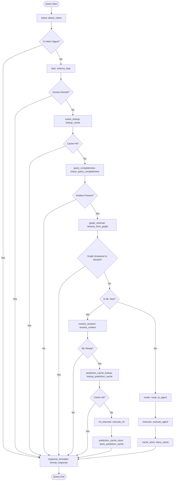

# IntelliSupply Agentic AI Component & Pipeline Guide

This guide provides a comprehensive overview of the **Agentic AI** sub-system within the IntelliSupply project. It details the system architecture, data flow, human-in-the-loop interaction patterns, and documents **every single file** within the `agentic_ai` directory.

---

## 1. High-Level Architecture & Flow

The Agentic AI layer acts as the conversational and decision-making engine of IntelliSupply. It is powered by **LangGraph**, which coordinates intent routing, role-based access control (RBAC), caching, factual database queries, context resolution, and machine learning model executions.

### 1.1 The LangGraph Orchestrator Flow

Every query sent to the agent is run through a state machine defined in [graph.py](file:///C:/Users/Relanto/Desktop/IntelliSupply/agentic_ai/orchestrator/graph.py).

---

## 2. Interactive Dialogues & Human-In-The-Loop (HITL)

The system implements a multi-turn, stateful conversation strategy when key parameters are missing:
1. **HITL Stage #1: Entity Clarification** (handled by [query_completeness_checker.py](file:///C:/Users/Relanto/Desktop/IntelliSupply/agentic_ai/context/query_completeness_checker.py)): Ensures minimum identifiers (e.g. `order_id` or `city`) exist in the query. If they are absent, the graph halts and returns a status of `clarification_required` with an entity lookup question.
2. **HITL Stage #2: Payload Clarification** (handled by [resolver.py](file:///C:/Users/Relanto/Desktop/IntelliSupply/agentic_ai/context/resolver.py)): After fetching what it can from Neo4j using the provided entities, if any required model parameter (e.g. `receipt_time` or `horizon`) is still missing, it prompts the user specifically for the missing fields.
3. **Conversational Tool parameter collection** (handled by [parameter_collector.py](file:///C:/Users/Relanto/Desktop/IntelliSupply/agentic_ai/integrations/parameter_collector.py)): Used by ReAct tool-calling agents to prompt for scalar variables or lists (e.g. order stops) one field at a time.

---

## 3. Detailed File Breakdown

Below is a granular catalog of all components and files inside the `agentic_ai` directory.

### 3.1 Root Directory Files

*   ### [main.py](file:///C:/Users/Relanto/Desktop/IntelliSupply/agentic_ai/main.py)
    *   **Description:** The Command-Line Interface (CLI) entrypoint. It runs an interactive chat loop where the user can query the system.
    *   **Core Functions:** 
        *   `main()`: Starts the user prompt loop.
        *   `_run_query_turn()`: Orchestrates single turns, handles clarification continuation loops, and updates multi-turn session states.
        *   `_print_result()`: Formats CLI answers depending on their source (cached, graph search, or ML model).
*   ### [README.md](file:///C:/Users/Relanto/Desktop/IntelliSupply/agentic_ai/README.md)
    *   **Description:** A quick reference document outlining the module’s folder layout, CLI entrypoint commands, and runtime dependencies.
*   ### [requirements.txt](file:///C:/Users/Relanto/Desktop/IntelliSupply/agentic_ai/requirements.txt)
    *   **Description:** Declares the Python packages required specifically for the AI agent stack, including `langgraph`, `pydantic`, `sqlalchemy`, and `openai`.

---

### 3.2 Agents Directory (`agentic_ai/agents/`)
Contains domain-specific, tool-calling conversation loops (ReAct agents).

*   ### [base_agent.py](file:///C:/Users/Relanto/Desktop/IntelliSupply/agentic_ai/agents/base_agent.py)
    *   **Description:** An abstract base class defining the contract for all registered specialist agents.
    *   **Core Symbols:**
        *   `BaseAgent`: Abstract class requiring an `execute(state: AgentState) -> str` implementation.
*   ### [inventory_agent.py](file:///C:/Users/Relanto/Desktop/IntelliSupply/agentic_ai/agents/inventory_agent.py)
    *   **Description:** The concrete specialist agent representing the Inventory domain.
    *   **Core Symbols:**
        *   `InventoryAgent`: Concrete agent class which forwards execution to `run_inventory_turn` and serializes results to JSON.
*   ### [inventory_agent_loop.py](file:///C:/Users/Relanto/Desktop/IntelliSupply/agentic_ai/agents/inventory_agent_loop.py)
    *   **Description:** The core ReAct loop for the inventory specialist. It lets the LLM invoke tools like `nl_to_sql` (Postgres) or `predict_demand` (Hugging Face model).
    *   **Core Functions:**
        *   `run_inventory_turn()`: Evaluates LLM choices, handles tool executions, and manages intermediate conversational states if fields are being collected.
*   ### [logistics_agent.py](file:///C:/Users/Relanto/Desktop/IntelliSupply/agentic_ai/agents/logistics_agent.py)
    *   **Description:** The concrete specialist agent representing the Logistics domain.
    *   **Core Symbols:**
        *   `LogisticsAgent`: Concrete agent class which forwards execution to `run_logistics_turn`.
*   ### [logistics_agent_loop.py](file:///C:/Users/Relanto/Desktop/IntelliSupply/agentic_ai/agents/logistics_agent_loop.py)
    *   **Description:** The ReAct loop for the logistics specialist. It enables tool invocation for `graphrag_query`, `predict_eta`, `predict_next_stop`, and `predict_route_sequence`.
    *   **Core Functions:**
        *   `run_logistics_turn()`: Executes the iterative tool-calling loop for logistics.

---

### 3.3 Cache Directory (`agentic_ai/cache/`)
Manages TTL-based caching of business query responses and machine learning predictions.

*   ### [\_\_init\_\_.py](file:///C:/Users/Relanto/Desktop/IntelliSupply/agentic_ai/cache/__init__.py)
    *   **Description:** Standard package initialization file.
*   ### [cache_key_builder.py](file:///C:/Users/Relanto/Desktop/IntelliSupply/agentic_ai/cache/cache_key_builder.py)
    *   **Description:** Extracts entity keys (e.g. `order_id`, `hub_id`, `city`) from natural language queries using regex, and compiles them into a deterministic SHA-256 cache key.
    *   **Core Symbols:**
        *   `CacheKeyBuilder`: Builds keys and checks if a task's mandatory entity requirements are met.
*   ### [cache_service.py](file:///C:/Users/Relanto/Desktop/IntelliSupply/agentic_ai/cache/cache_service.py)
    *   **Description:** A facade wrapper implementing cache storage mechanics. Supports swappable backends (defaults to `MemoryCache`).
    *   **Core Symbols:**
        *   `CacheBackend`: Protocol representing required cache actions (`get`, `set`, `delete`, `clear`, `stats`).
        *   `CacheService`: Exposes task-aware caching utilities.
*   ### [memory_cache.py](file:///C:/Users/Relanto/Desktop/IntelliSupply/agentic_ai/cache/memory_cache.py)
    *   **Description:** A simple dictionary-based cache that stores key-value pairs in memory, enforcing key expirations by comparing system timestamps.
    *   **Core Symbols:**
        *   `MemoryCache`: Stores entries alongside expiry times, tracking hit/miss telemetry.
*   ### [pipeline.md](file:///C:/Users/Relanto/Desktop/IntelliSupply/agentic_ai/cache/pipeline.md)
    *   **Description:** A runtime execution reference documenting endpoints, startup processes, data flow pathways, and core integration states.
*   ### [prediction_cache_config.py](file:///C:/Users/Relanto/Desktop/IntelliSupply/agentic_ai/cache/prediction_cache_config.py)
    *   **Description:** Defines tasks eligible for ML prediction cache updates and their corresponding TTL expirations (e.g. 5 minutes for routing/ETA, 1 hour for demand).
*   ### [prediction_cache_key_builder.py](file:///C:/Users/Relanto/Desktop/IntelliSupply/agentic_ai/cache/prediction_cache_key_builder.py)
    *   **Description:** Builds cache keys for final model predictions using resolved business identifiers (e.g. `order_id` or `city:horizon`) rather than raw user text.
    *   **Core Symbols:**
        *   `PredictionCacheKeyBuilder`: Computes exact model result cache keys.
*   ### [ttl_config.py](file:///C:/Users/Relanto/Desktop/IntelliSupply/agentic_ai/cache/ttl_config.py)
    *   **Description:** Central configuration specifying cacheable lookup tasks and their TTL values in seconds.

---

### 3.4 Context Directory (`agentic_ai/context/`)
Manages entity extraction, payload assembly, and data enrichment before executing ML tasks.

*   ### [\_\_init\_\_.py](file:///C:/Users/Relanto/Desktop/IntelliSupply/agentic_ai/context/__init__.py)
    *   **Description:** Package initializer.
*   ### [clarification_manager.py](file:///C:/Users/Relanto/Desktop/IntelliSupply/agentic_ai/context/clarification_manager.py)
    *   **Description:** Generates human-friendly clarification questions for missing entities or payload values while masking internal system variables.
    *   **Core Symbols:**
        *   `ClarificationManager`: Map templates to business-friendly follow-up queries.
*   ### [context_node.py](file:///C:/Users/Relanto/Desktop/IntelliSupply/agentic_ai/context/context_node.py)
    *   **Description:** Implements the LangGraph nodes responsible for verification checks.
    *   **Core Functions:**
        *   `check_query_completeness()`: Runs prior to graph lookups to verify minimal input entities exist.
        *   `resolve_context()`: Runs after graph retrieval to load variables, validate resources, and check payload readiness.
*   ### [entity_extractor.py](file:///C:/Users/Relanto/Desktop/IntelliSupply/agentic_ai/context/entity_extractor.py)
    *   **Description:** Standardized regex parser to extract structural identifiers (orders, couriers, hubs, city names, forecast horizons) from user input queries.
    *   **Core Symbols:**
        *   `EntityExtractor`: Normalizes tokens and converts bare numeric values to structured keys (e.g. `Hub_55`).
*   ### [field_source_registry.py](file:///C:/Users/Relanto/Desktop/IntelliSupply/agentic_ai/context/field_source_registry.py)
    *   **Description:** Defines the canonical source for every required ML parameter. Sources include `"graph"`, `"user"`, `"user_or_graph"`, or `"system_default"`.
*   ### [graph_resolver.py](file:///C:/Users/Relanto/Desktop/IntelliSupply/agentic_ai/context/graph_resolver.py)
    *   **Description:** Executes direct, structured Cypher queries against Neo4j to resolve geographical coords and courier details for a specific shipment.
    *   **Core Symbols:**
        *   `GraphResolver`: Connects to `GraphService` and runs order-by-id and order-by-hubs Cypher scripts.
*   ### [missing_field_detector.py](file:///C:/Users/Relanto/Desktop/IntelliSupply/agentic_ai/context/missing_field_detector.py)
    *   **Description:** Inspects parsed payloads against mandatory model inputs to return list gaps.
    *   **Core Symbols:**
        *   `MissingFieldDetector`: Scans a dictionary for missing or null parameters.
*   ### [payload_builder.py](file:///C:/Users/Relanto/Desktop/IntelliSupply/agentic_ai/context/payload_builder.py)
    *   **Description:** Assembles ML payloads by pulling values from graph data, user input, and system defaults.
    *   **Core Symbols:**
        *   `PayloadBuilder`: Merges fields, handles task-specific aliases, and applies fallbacks.
*   ### [query_completeness_checker.py](file:///C:/Users/Relanto/Desktop/IntelliSupply/agentic_ai/context/query_completeness_checker.py)
    *   **Description:** Validates whether the user query contains sufficient search keys to start querying Neo4j.
    *   **Core Symbols:**
        *   `QueryCompletenessChecker`: Performs checks and raises clarification requests if necessary.
*   ### [resolver.py](file:///C:/Users/Relanto/Desktop/IntelliSupply/agentic_ai/context/resolver.py)
    *   **Description:** Integrates `GraphResolver`, `PayloadBuilder`, and `MissingFieldDetector` into a single resolution workflow.
    *   **Core Symbols:**
        *   `ContextResolver`: Determines whether the context is ready for machine learning inference.
*   ### [task_requirements.py](file:///C:/Users/Relanto/Desktop/IntelliSupply/agentic_ai/context/task_requirements.py)
    *   **Description:** Configures the exact list of required feature variables per model task, and mapping requirements for graph queries.

---

### 3.5 Graph Retrieval Directory (`agentic_ai/graph_retrieval/`)
Enables direct, fast graph retrieval (Neo4j) for factual lookup queries.

*   ### [\_\_init\_\_.py](file:///C:/Users/Relanto/Desktop/IntelliSupply/agentic_ai/graph_retrieval/__init__.py)
    *   **Description:** Package initializer.
*   ### [cypher_generator.py](file:///C:/Users/Relanto/Desktop/IntelliSupply/agentic_ai/graph_retrieval/cypher_generator.py)
    *   **Description:** Translates factual lookup tasks (e.g. shipment tracking or route schedules) into read-only Neo4j Cypher queries.
    *   **Core Symbols:**
        *   `CypherGenerator`: Translates inputs using deterministic templates, falling back to LLM-guided query generation. Validates that queries do not contain write commands.
*   ### [entity_extractor.py](file:///C:/Users/Relanto/Desktop/IntelliSupply/agentic_ai/graph_retrieval/entity_extractor.py)
    *   **Description:** Re-exports the shared `EntityExtractor` from the context layer to ensure consistency.
*   ### [graph_authorizer.py](file:///C:/Users/Relanto/Desktop/IntelliSupply/agentic_ai/graph_retrieval/graph_authorizer.py)
    *   **Description:** Implements resource-level authentication checks. For example, it ensures couriers can only look up their own routes.
    *   **Core Symbols:**
        *   `GraphAuthorizer`: Validates role clearance and matches request properties with session parameters.
*   ### [graph_node.py](file:///C:/Users/Relanto/Desktop/IntelliSupply/agentic_ai/graph_retrieval/graph_node.py)
    *   **Description:** The LangGraph node that attempts to solve factual questions using graph queries before routing to specialist agents or ML models.
    *   **Core Functions:**
        *   `retrieve_from_graph()`: Performs resource authorization checks and calls the retriever.
*   ### [graph_retriever.py](file:///C:/Users/Relanto/Desktop/IntelliSupply/agentic_ai/graph_retrieval/graph_retriever.py)
    *   **Description:** Orchestrates the graph retrieval pipeline by generating Cypher, running it against Neo4j, and parsing results.
    *   **Core Symbols:**
        *   `GraphRetriever`: Resolves requests using the Neo4j query generator and mapper.
*   ### [graph_service.py](file:///C:/Users/Relanto/Desktop/IntelliSupply/agentic_ai/graph_retrieval/graph_service.py)
    *   **Description:** A helper service that dynamically loads Neo4j connection classes from the `rag/` root and runs queries.
    *   **Core Symbols:**
        *   `GraphService`: Exposes the `execute(cypher, parameters)` method, which handles transaction logs and exceptions.
*   ### [result_mapper.py](file:///C:/Users/Relanto/Desktop/IntelliSupply/agentic_ai/graph_retrieval/result_mapper.py)
    *   **Description:** Normalizes raw dictionaries returned by Neo4j into standard JSON-ready business objects.
    *   **Core Symbols:**
        *   `ResultMapper`: Maps database records to structured logistics formats.

---

### 3.6 Integrations Directory (`agentic_ai/integrations/`)
Provides bridges to databases, LLMs, and external models.

*   ### [\_\_init\_\_.py](file:///C:/Users/Relanto/Desktop/IntelliSupply/agentic_ai/integrations/__init__.py)
    *   **Description:** Package initializer.
*   ### [graph_bridge.py](file:///C:/Users/Relanto/Desktop/IntelliSupply/agentic_ai/integrations/graph_bridge.py)
    *   **Description:** Interface linking agents to the GraphRAG querying logic. Includes a sufficiency check to determine if the graph query resolved the user's request or if it requires falling back to an ML model.
    *   **Core Functions:**
        *   `try_graph_answer()`: Queries the graph and returns the response.
        *   `is_graph_sufficient()`: Returns `False` if the graph response is empty or contains "not found" phrases.
*   ### [inventory_tools.py](file:///C:/Users/Relanto/Desktop/IntelliSupply/agentic_ai/integrations/inventory_tools.py)
    *   **Description:** Configures OpenAI function-call schemas and execution wrappers for the inventory agent.
    *   **Core Functions:**
        *   `execute_tool()`: Routes tool executions to SQL generators or demand forecasting models.
*   ### [llm_client.py](file:///C:/Users/Relanto/Desktop/IntelliSupply/agentic_ai/integrations/llm_client.py)
    *   **Description:** Singleton factory providing a unified OpenAI client configured to talk to the NVIDIA API.
    *   **Core Functions:**
        *   `get_client()`: Initializes the connection client.
        *   `get_model()`: Reads the default LLM model name from environment variables.
*   ### [logistics_tools.py](file:///C:/Users/Relanto/Desktop/IntelliSupply/agentic_ai/integrations/logistics_tools.py)
    *   **Description:** OpenAI function schemas and tool runners for the logistics agent.
    *   **Core Functions:**
        *   `execute_tool()`: Wires calls to graph databases or ML prediction engines.
*   ### [ml_bridge.py](file:///C:/Users/Relanto/Desktop/IntelliSupply/agentic_ai/integrations/ml_bridge.py)
    *   **Description:** Integrates agent tasks with FastAPI backend service helpers (e.g. routing, demand, ETA prediction services) by dynamically managing the system import path.
    *   **Core Functions:**
        *   `run_eta_prediction()` / `run_demand_prediction()` / `run_route_next_stop()`: Dynamically loads the corresponding FastAPI service file and invokes its prediction logic.
*   ### [ml_payload.py](file:///C:/Users/Relanto/Desktop/IntelliSupply/agentic_ai/integrations/ml_payload.py)
    *   **Description:** Resolves ML prediction request payloads from natural language by combining LLM extractions with Pydantic validation. Uses grounding validation to prevent hallucinated coordinates or IDs.
    *   **Core Symbols:**
        *   `resolve_ml_payload()`: Extracts and merges inputs across conversation turns, verifying field alignment.
*   ### [parameter_collector.py](file:///C:/Users/Relanto/Desktop/IntelliSupply/agentic_ai/integrations/parameter_collector.py)
    *   **Description:** Implements step-by-step conversational parameter gathering for ML tools.
    *   **Core Functions:**
        *   `next_collection_step()`: Determines which required field is missing and generates a question prompt.
        *   `parse_field_answer()`: Extracts, converts, and stores user responses. Supports scalar values and lists (e.g. multiple order stop coordinates).
*   ### [sql_bridge.py](file:///C:/Users/Relanto/Desktop/IntelliSupply/agentic_ai/integrations/sql_bridge.py)
    *   **Description:** Implements natural language-to-SQL generation and execution against PostgreSQL.
    *   **Core Functions:**
        *   `ask_inventory_sql()`: Connects to Postgres using SQLAlchemy, runs SQL commands, and uses an LLM to summarize results in natural language.

---

### 3.7 Orchestrator Directory (`agentic_ai/orchestrator/`)
The LangGraph workflow orchestrator that processes queries, enforces security policies, and formats responses.

*   ### [cache_node.py](file:///C:/Users/Relanto/Desktop/IntelliSupply/agentic_ai/orchestrator/cache_node.py)
    *   **Description:** Defines LangGraph nodes that search for cached results or store completed agent responses.
    *   **Core Functions:**
        *   `lookup_cache()`: Performs a pre-routing check for cached answers.
        *   `store_cache()`: Caches successful agent runs using task-specific TTLs.
*   ### [executor.py](file:///C:/Users/Relanto/Desktop/IntelliSupply/agentic_ai/orchestrator/executor.py)
    *   **Description:** The LangGraph execution node that looks up the active specialist agent in the registry and runs it.
    *   **Core Functions:**
        *   `execute_agent()`: Checks resource RBAC permissions and runs the agent.
*   ### [graph.py](file:///C:/Users/Relanto/Desktop/IntelliSupply/agentic_ai/orchestrator/graph.py)
    *   **Description:** Wires all nodes and conditional transition edges into the orchestrator's LangGraph application flow.
    *   **Core Functions:**
        *   `build_graph()`: Wires states, nodes, and conditional edges, returning a compiled graph app.
        *   `run_orchestrator()`: Prepares the initial state dictionary and invokes the compiled LangGraph execution.
*   ### [intent.py](file:///C:/Users/Relanto/Desktop/IntelliSupply/agentic_ai/orchestrator/intent.py)
    *   **Description:** Evaluates the user query to assign its domain (inventory vs logistics) and task.
    *   **Core Functions:**
        *   `detect_intent()`: Classifies queries. It bypasses LLM classification if a session is in the middle of gathering fields to ensure conversational continuity.
*   ### [intent_task_classifier.py](file:///C:/Users/Relanto/Desktop/IntelliSupply/agentic_ai/orchestrator/intent_task_classifier.py)
    *   **Description:** Performs domain and task classification using the NVIDIA API client, returning a structured JSON response with a confidence score. Falls back to a rules-based parser if the LLM call fails.
    *   **Core Symbols:**
        *   `classify_domain_task()`: Returns predicted domains and tasks.
        *   `needs_intent_clarification()`: Flags low-confidence classifications.
*   ### [ml_node.py](file:///C:/Users/Relanto/Desktop/IntelliSupply/agentic_ai/orchestrator/ml_node.py)
    *   **Description:** The LangGraph execution node that runs the production machine learning pipeline.
    *   **Core Functions:**
        *   `execute_ml()`: Executes ML prediction models. Validates courier resource permissions before execution.
*   ### [prediction_cache_node.py](file:///C:/Users/Relanto/Desktop/IntelliSupply/agentic_ai/orchestrator/prediction_cache_node.py)
    *   **Description:** Handles prediction caching for ML outputs, reducing costs by bypassing model execution for duplicate queries.
    *   **Core Functions:**
        *   `lookup_prediction_cache()`: Retrieves cached predictions.
        *   `store_prediction_cache()`: Stores successful ML prediction outputs.
*   ### [rbac_node.py](file:///C:/Users/Relanto/Desktop/IntelliSupply/agentic_ai/orchestrator/rbac_node.py)
    *   **Description:** The LangGraph node that validates the user's role against the classified task.
    *   **Core Functions:**
        *   `enforce_rbac()`: Blocks execution and returns a denied status if the role is unauthorized.
*   ### [resource_rbac.py](file:///C:/Users/Relanto/Desktop/IntelliSupply/agentic_ai/orchestrator/resource_rbac.py)
    *   **Description:** Enforces fine-grained resource-level permissions (e.g. validating courier permissions on specific route sequences) across graph and ML paths.
    *   **Core Functions:**
        *   `authorize_courier_resource()`: Resolves courier IDs and calls the authorization engine.
*   ### [response_formatter.py](file:///C:/Users/Relanto/Desktop/IntelliSupply/agentic_ai/orchestrator/response_formatter.py)
    *   **Description:** Formats the final agent state into a standardized JSON schema for the frontend.
    *   **Core Symbols:**
        *   `ResponseFormatter`: Formats cached hits, graph lookups, model predictions, RBAC denials, and agent responses into a consistent schema.
*   ### [router.py](file:///C:/Users/Relanto/Desktop/IntelliSupply/agentic_ai/orchestrator/router.py)
    *   **Description:** Maps the assigned query domain (inventory or logistics) to the specialist agent name.
*   ### [state.py](file:///C:/Users/Relanto/Desktop/IntelliSupply/agentic_ai/orchestrator/state.py)
    *   **Description:** Declares the shared state schema carried and updated across LangGraph nodes.
    *   **Core Symbols:**
        *   `AgentState`: Typed dict definition tracking the user query, resolved parameters, cache status, and output responses.

---

#### 3.7.1 RBAC Subdirectory (`agentic_ai/orchestrator/rbac/`)
Handles role-based security access matrices and identity mapping.

*   ### [\_\_init\_\_.py](file:///C:/Users/Relanto/Desktop/IntelliSupply/agentic_ai/orchestrator/rbac/__init__.py)
    *   **Description:** Package initializer.
*   ### [courier_identity.py](file:///C:/Users/Relanto/Desktop/IntelliSupply/agentic_ai/orchestrator/rbac/courier_identity.py)
    *   **Description:** Binds courier identities to sessions when authenticating requests.
    *   **Core Functions:**
        *   `resolve_courier_identity()`: Normalizes user roles and registers courier IDs inside logistics sessions.
*   ### [exceptions.py](file:///C:/Users/Relanto/Desktop/IntelliSupply/agentic_ai/orchestrator/rbac/exceptions.py)
    *   **Description:** Defines custom exceptions for RBAC failures (e.g. `UnauthorizedTaskError`, `UnknownRoleError`).
*   ### [permissions.py](file:///C:/Users/Relanto/Desktop/IntelliSupply/agentic_ai/orchestrator/rbac/permissions.py)
    *   **Description:** Defines the core permissions matrix mapping roles (`ADMIN`, `LOGISTICS`, `INVENTORY`, `COURIER`) to their allowed tasks.
*   ### [rbac_service.py](file:///C:/Users/Relanto/Desktop/IntelliSupply/agentic_ai/orchestrator/rbac/rbac_service.py)
    *   **Description:** Core service validating task permissions and generating access denial messages.
    *   **Core Symbols:**
        *   `RBACService`: Checks access levels and throws exceptions for unauthorized attempts.
*   ### [role_mapper.py](file:///C:/Users/Relanto/Desktop/IntelliSupply/agentic_ai/orchestrator/rbac/role_mapper.py)
    *   **Description:** Maps external roles (e.g. `logistics_manager` or `inventory_manager`) to the internal roles used by the RBAC matrix.
    *   **Core Functions:**
        *   `map_to_orchestrator_role()`: Normalizes role strings.
*   ### [session_context.py](file:///C:/Users/Relanto/Desktop/IntelliSupply/agentic_ai/orchestrator/rbac/session_context.py)
    *   **Description:** Restores and persists security context and conversation states across multi-turn sessions.
    *   **Core Functions:**
        *   `restore_user_role()`: Reconstructs roles from active sessions.
        *   `build_session_for_response()`: Packages conversational contexts back to the client.

---

### 3.8 Registry Directory (`agentic_ai/registry/`)

*   ### [agent_registry.py](file:///C:/Users/Relanto/Desktop/IntelliSupply/agentic_ai/registry/agent_registry.py)
    *   **Description:** Houses the registry of domain agents. The orchestrator's executor lookup node queries this registry to load the proper agent.
    *   **Core Functions:**
        *   `get_agent()`: Retrieves the registered singleton instance of `InventoryAgent` or `LogisticsAgent`.

---

### 3.9 Tests Directory (`agentic_ai/tests/`)
Houses tests verifying code reliability across the AI agent pipeline.

*   ### [test_cache.py](file:///C:/Users/Relanto/Desktop/IntelliSupply/agentic_ai/tests/test_cache.py)
    *   **Description:** Tests memory cache services, key generation rules, and task-based TTL configurations.
*   ### [test_context.py](file:///C:/Users/Relanto/Desktop/IntelliSupply/agentic_ai/tests/test_context.py)
    *   **Description:** Tests entity extraction patterns and field source registry validations.
*   ### [test_context_integration.py](file:///C:/Users/Relanto/Desktop/IntelliSupply/agentic_ai/tests/test_context_integration.py)
    *   **Description:** Verifies end-to-end context resolution, Neo4j resolver lookups, and Pydantic validation mappings.
*   ### [test_courier_resource_rbac.py](file:///C:/Users/Relanto/Desktop/IntelliSupply/agentic_ai/tests/test_courier_resource_rbac.py)
    *   **Description:** Tests resource-level security rules for couriers lookup queries.
*   ### [test_graph_retrieval.py](file:///C:/Users/Relanto/Desktop/IntelliSupply/agentic_ai/tests/test_graph_retrieval.py)
    *   **Description:** Verifies Cypher query generation templates and read-only schema filters.
*   ### [test_graph_retrieval_integration.py](file:///C:/Users/Relanto/Desktop/IntelliSupply/agentic_ai/tests/test_graph_retrieval_integration.py)
    *   **Description:** Tests graph queries against mock and real Neo4j connections.
*   ### [test_identity_propagation.py](file:///C:/Users/Relanto/Desktop/IntelliSupply/agentic_ai/tests/test_identity_propagation.py)
    *   **Description:** Tests the propagation of authentication credentials and courier identities across multi-turn sessions.
*   ### [test_intent.py](file:///C:/Users/Relanto/Desktop/IntelliSupply/agentic_ai/tests/test_intent.py)
    *   **Description:** Tests the orchestrator's intent node, ensuring vague queries trigger clarification loops.
*   ### [test_intent_task_classifier.py](file:///C:/Users/Relanto/Desktop/IntelliSupply/agentic_ai/tests/test_intent_task_classifier.py)
    *   **Description:** Tests the domain/task LLM classifier and rules-based fallback logic.
*   ### [test_ml_payload.py](file:///C:/Users/Relanto/Desktop/IntelliSupply/agentic_ai/tests/test_ml_payload.py)
    *   **Description:** Verifies ML request body extractions, coordinate rounding defenses, and formatting.
*   ### [test_ml_resource_rbac.py](file:///C:/Users/Relanto/Desktop/IntelliSupply/agentic_ai/tests/test_ml_resource_rbac.py)
    *   **Description:** Tests model execution permission filters.
*   ### [test_multiturn_rbac.py](file:///C:/Users/Relanto/Desktop/IntelliSupply/agentic_ai/tests/test_multiturn_rbac.py)
    *   **Description:** Verifies that user credentials cannot be tampered with between conversational turns.
*   ### [test_orchestrator.py](file:///C:/Users/Relanto/Desktop/IntelliSupply/agentic_ai/tests/test_orchestrator.py)
    *   **Description:** Validates end-to-end state transitions across nodes in the LangGraph graph.
*   ### [test_parameter_collector.py](file:///C:/Users/Relanto/Desktop/IntelliSupply/agentic_ai/tests/test_parameter_collector.py)
    *   **Description:** Verifies step-by-step collection behavior for scalar and list parameters.
*   ### [test_prediction_cache.py](file:///C:/Users/Relanto/Desktop/IntelliSupply/agentic_ai/tests/test_prediction_cache.py)
    *   **Description:** Tests prediction cache key parsing and configurations.
*   ### [test_prediction_cache_integration.py](file:///C:/Users/Relanto/Desktop/IntelliSupply/agentic_ai/tests/test_prediction_cache_integration.py)
    *   **Description:** Tests cache integration, verifying cache hits skip ML executor nodes.
*   ### [test_rbac.py](file:///C:/Users/Relanto/Desktop/IntelliSupply/agentic_ai/tests/test_rbac.py)
    *   **Description:** Tests the RBAC Service, checking role checks against task matrices.
*   ### [test_role_mapping.py](file:///C:/Users/Relanto/Desktop/IntelliSupply/agentic_ai/tests/test_role_mapping.py)
    *   **Description:** Verifies role mapper functionality.
