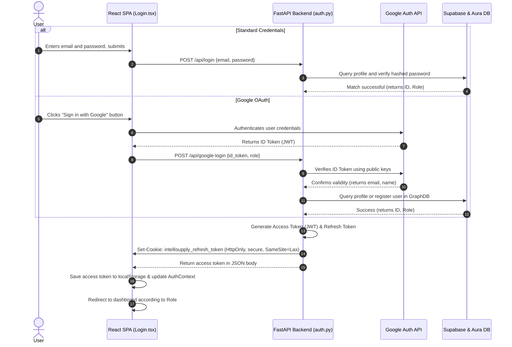
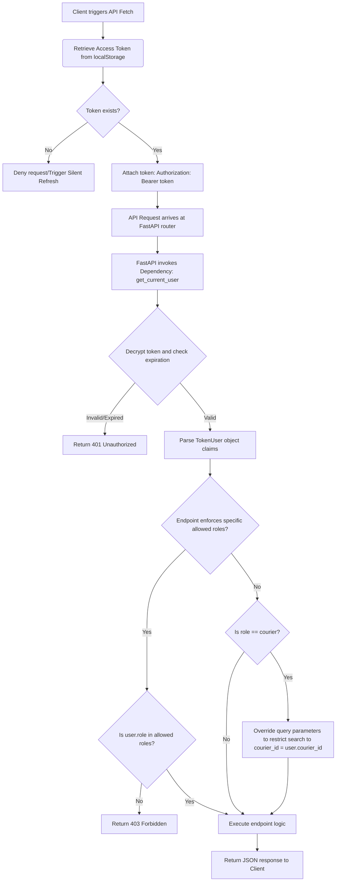
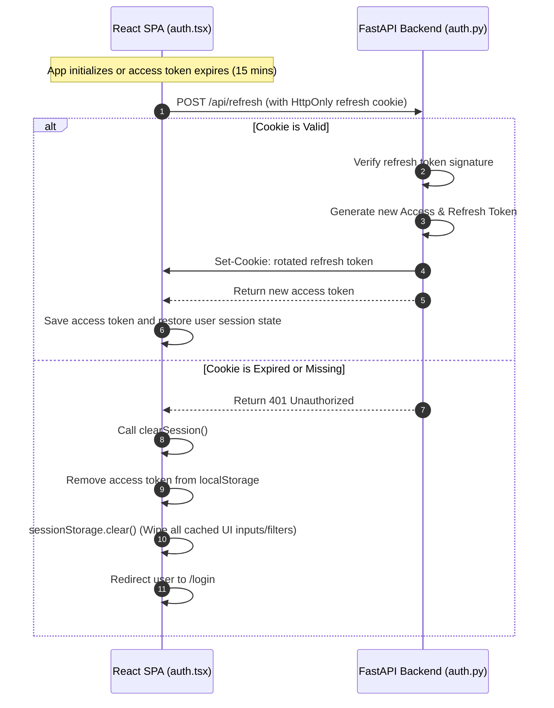
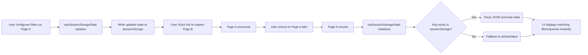

# Security, Identity & State Pipeline: OAuth, RBAC, Session Persistence, and Storage

This document provides a detailed walkthrough of the identity, authorization, session management, and state persistence architecture implemented in the **IntelliSupply** project.

---

## 1. Glossary of Technical Terms

*   **OAuth 2.0 (Open Authorization):** An industry-standard protocol for authorization that allows a user to grant a third-party application (e.g., Google) access to their resources without sharing their credentials (passwords).
*   **ID Token:** A JSON Web Token (JWT) issued by an identity provider (like Google) containing claims about the identity of the authenticated user (e.g., name, email, profile picture).
*   **RBAC (Role-Based Access Control):** A system configuration that grants or restricts resource access based on a user's defined role (e.g., `admin`, `courier`) rather than their individual identity.
*   **JWT (JSON Web Token):** A compact, URL-safe means of representing claims to be transferred between two parties. The claims in a JWT are cryptographically signed, making them tamper-proof.
*   **Access Token:** A short-lived token (usually valid for 15 minutes) passed in the `Authorization` header of API requests to authenticate the user and authorize resource access.
*   **Refresh Token:** A long-lived token (usually valid for 7 days) used to automatically request a new access token when the current one expires, preventing the user from being logged out frequently.
*   **HttpOnly Cookie:** A cookie attribute that prevents client-side scripts (JavaScript) from accessing the cookie. This protects the cookie from theft via Cross-Site Scripting (XSS) attacks.
*   **SameSite Attribute:** A cookie security attribute (configured to `Lax` in this project) that controls whether cookies are sent with cross-site requests, mitigating Cross-Site Request Forgery (CSRF) attacks.
*   **sessionStorage:** A web storage API in the browser that stores key-value pairs for the duration of the page session (the lifespan of the active browser tab). Data is wiped immediately when the tab is closed.
*   **localStorage:** A web storage API in the browser that stores key-value pairs indefinitely. Data survives browser restarts and is shared across all tabs of the same origin until explicitly cleared.
*   **Same-Origin Policy (SOP):** A critical web browser security mechanism that restricts scripts on one page from accessing data on another page if they have different origins (protocol, host, or port).
*   **Graph Database (Neo4j / Aura):** A NoSQL database that stores data as nodes (entities) and edges (relationships), queried using the Cypher query language. Excellent for modeling routes, logistics networks, and courier assignments.

---

## 2. Architecture & File Breakdown

The following files orchestrate OAuth, RBAC, session persistence, and storage throughout the project.

### A. Authentication & OAuth Layer
*   **[Login.tsx](file:///c:/Users/GauryJithesh/Desktop/aarushi/IntelliSupply/frontend/app/src/pages/Login.tsx):**
    *   *Purpose:* Handles the user login UI.
    *   *OAuth Role:* Loads the external Google OneTap/OAuth script. It initializes the Google client and renders the Google Login button. Upon a successful sign-in, it catches the Google `id_token` and calls the `googleLogin` API wrapper, passing the token and selected role.
    *   *Transient State:* Uses standard React `useState` for transient form states (`email`, `password`) ensuring no credentials are cached in browser storage.
*   **[auth.py](file:///c:/Users/GauryJithesh/Desktop/aarushi/IntelliSupply/FastAPI/routers/auth.py):**
    *   *Purpose:* Defines the authentication API endpoints (`/api/login`, `/api/register`, `/api/google-login`, `/api/refresh`, `/api/logout`, `/api/me`).
    *   *OAuth Role:* `/api/google-login` receives the Google token, validates it cryptographically against Google's public keys using `google.oauth2.id_token`, and extracts the email/name. It then merges or registers the user in Supabase/Aura DB.
    *   *Token Issuance:* Signs access and refresh tokens, sets the secure, `HttpOnly`, `SameSite=Lax` refresh cookie (`intellisupply_refresh_token`), and sends back the JSON payload containing the access token.

### B. Access Control & RBAC Layer
*   **[auth.py](file:///c:/Users/GauryJithesh/Desktop/aarushi/IntelliSupply/FastAPI/dependencies/auth.py):**
    *   *Purpose:* Houses token decoding, validation, and FastAPI injection dependencies.
    *   *RBAC Role:* Defines the `TokenUser` model. It contains the dependency function `get_current_user` which extracts the Bearer token from the request header, decodes it using the server's private secret, checks expiration, and extracts user claims (ID, email, role, courier ID).
*   **[ProtectedRoute.tsx](file:///c:/Users/GauryJithesh/Desktop/aarushi/IntelliSupply/frontend/app/src/components/ProtectedRoute.tsx):**
    *   *Purpose:* Implements client-side route protection.
    *   *RBAC Role:* Inspects the authenticated user's role in the client context. If the user's role is not included in the `allowedRoles` array, it intercepts navigation and redirects them back to their appropriate home page (enforcing separation between couriers and managers).
*   **[App.tsx](file:///c:/Users/GauryJithesh/Desktop/aarushi/IntelliSupply/frontend/app/src/App.tsx):**
    *   *Purpose:* Configures the React Router structure.
    *   *RBAC Role:* Wraps routes in `<ProtectedRoute allowedRoles={[...]}>`. For example, `/planning` and `/inventory` are restricted to `['admin', 'inventory_manager']`, while `/courier` is strictly scoped to `['courier']`.

### C. Session Persistence Layer
*   **[auth.tsx](file:///c:/Users/GauryJithesh/Desktop/aarushi/IntelliSupply/frontend/app/src/lib/auth.tsx):**
    *   *Purpose:* Context provider wrapping the React application (`AuthProvider`) to expose auth states (`user`, `loading`, `login`, `logout`).
    *   *Session Persistence Role:*
        *   On mount, it checks `localStorage` for a cached user profile. If found, it populates the local state immediately to prevent jarring UI flashes.
        *   It then issues a silent verification call to `fetchCurrentUser()`. If successful, it updates the profile. If the token is missing/expired, it automatically triggers a silent refresh call `/api/refresh`.
        *   **`sessionStorage.clear()` on Logout:** In `clearSession` (triggered on logout or token verification failure), it clears `sessionStorage` completely, ensuring no filters, queries, or chat logs are left behind.
*   **[api.ts](file:///c:/Users/GauryJithesh/Desktop/aarushi/IntelliSupply/frontend/app/src/lib/api.ts):**
    *   *Purpose:* Centralized Axios/Fetch wrapper interface.
    *   *Session Persistence Role:* Contains standard helper methods `getAccessToken()`, `setAccessToken()`, and `apiFetch()`. It stores the access token in `localStorage` under `'intellisupply_token'` and automatically appends it to outgoing API requests via the `Authorization: Bearer <token>` header.

### D. UI Caching & Storage Layer
*   **[useSessionStorage.ts](file:///c:/Users/GauryJithesh/Desktop/aarushi/IntelliSupply/frontend/app/src/hooks/useSessionStorage.ts):**
    *   *Purpose:* Generic React state-sync storage hook `useSessionStorageState`.
    *   *Storage Role:* Replaces standard `useState` hooks to write changes synchronously to the tab's `sessionStorage`. Features key-change tracking (`prevKey` comparison) to prevent overwriting storage when switching page contexts and cleans up `undefined` parameters to prevent JSON syntax errors on parsing.
*   **Pages & Components using it:**
    *   [Planning.tsx](file:///c:/Users/GauryJithesh/Desktop/aarushi/IntelliSupply/frontend/app/src/pages/Planning.tsx) (Filters, input query text, active simulation results).
    *   [Home.tsx](file:///c:/Users/GauryJithesh/Desktop/aarushi/IntelliSupply/frontend/app/src/pages/Home.tsx) (Logistics filters, courier selection, highlighted orders).
    *   [Courier.tsx](file:///c:/Users/GauryJithesh/Desktop/aarushi/IntelliSupply/frontend/app/src/pages/Courier.tsx) (Date selections, courier route ID, active stops).
    *   [Inventory.tsx](file:///c:/Users/GauryJithesh/Desktop/aarushi/IntelliSupply/frontend/app/src/pages/Inventory.tsx) (Search bar query, category filter, status filter, sidebar product details).
    *   [RouteIntelligence.tsx](file:///c:/Users/GauryJithesh/Desktop/aarushi/IntelliSupply/frontend/app/src/pages/RouteIntelligence.tsx) (Selected map route).
    *   [Notifications.tsx](file:///c:/Users/GauryJithesh/Desktop/aarushi/IntelliSupply/frontend/app/src/pages/Notifications.tsx) (Feed tabs, unread toggle, search text).
    *   [AdminUsers.tsx](file:///c:/Users/GauryJithesh/Desktop/aarushi/IntelliSupply/frontend/app/src/pages/AdminUsers.tsx) (Directory search and filter queries).
    *   [AICopilot.tsx](file:///c:/Users/GauryJithesh/Desktop/aarushi/IntelliSupply/frontend/app/src/components/AICopilot.tsx) (AI dialogue history separated by `domain` key, logistics/inventory session states).

---

## 3. Workflows & Execution Pipelines

### A. The Login Workflow (Standard & Google OAuth)

---

### B. API Request Authorization & RBAC Pipeline

---

### C. Silent Session Persistence (Silent Refresh)

---

### D. UI Caching / State Preservation Workflow

