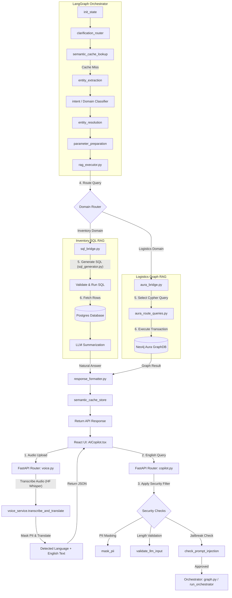

# RAG Architecture & Data Routing Pipeline: React, FastAPI, Orchestrator, and Databases

This document explains the purpose of each file within the `rag/` directory of the **IntelliSupply** project, and traces the step-by-step routing of query and audio payloads from the frontend to the orchestrator, and finally through the appropriate RAG storage nodes.

---

## 1. Directory & File Guide: The `rag` Directory

The `rag/` folder holds the data retrieval libraries, schema definitions, connection drivers, and seeding utilities for three primary database domains: **Supabase (Postgres)**, **Aura (Neo4j GraphDB)**, and the **Inventory SQL Chatbot**.

### A. Supabase Postgres Layer (`rag/supabase/`)
*   **[supabase_connection.py](file:///c:/Users/GauryJithesh/Desktop/aarushi/IntelliSupply/rag/supabase/supabase_connection.py):** Establishes the connection engine to Supabase Postgres via SQLAlchemy using `DATABASE_URL`.
*   **[supabase_auth.py](file:///c:/Users/GauryJithesh/Desktop/aarushi/IntelliSupply/rag/supabase/supabase_auth.py):** Executes database-level user authentication, including creating users, verifying password hashes (using `bcrypt`), updating profiles, and resolving roles.
*   **[supabase_inventory.py](file:///c:/Users/GauryJithesh/Desktop/aarushi/IntelliSupply/rag/supabase/supabase_inventory.py):** Handles queries and transactions for managing catalog products, tracking inventory shipments, and editing physical stock items.
*   **[supabase_notifications.py](file:///c:/Users/GauryJithesh/Desktop/aarushi/IntelliSupply/rag/supabase/supabase_notifications.py):** Handles CRUD queries for user notification feeds, allowing endpoints to fetch unread alerts, mark alerts as read, or post system notifications.
*   **[backfill_notifications.py](file:///c:/Users/GauryJithesh/Desktop/aarushi/IntelliSupply/rag/supabase/backfill_notifications.py):** A CLI utility script to populate mock alerts and warnings (e.g., low stock warnings, courier updates) for demonstration purposes.

### B. Aura Graph Database Layer (`rag/aura_graphdb/`)
*   **[aura_connection.py](file:///c:/Users/GauryJithesh/Desktop/aarushi/IntelliSupply/rag/aura_graphdb/aura_connection.py):** Initializes the official Neo4j driver using URI credentials, manages transaction lifecycles, and registers runtime query observers for logging.
*   **[aura_route_queries.py](file:///c:/Users/GauryJithesh/Desktop/aarushi/IntelliSupply/rag/aura_graphdb/aura_route_queries.py):** Contains Cypher-based retrieval functions for tracing order routes, listing courier routes, fetching delivery schedules, and resolving recent shipments.
*   **[aura_courier.py](file:///c:/Users/GauryJithesh/Desktop/aarushi/IntelliSupply/rag/aura_graphdb/aura_courier.py):** Manages courier node relationships, active shifts, cities, and status updates (e.g., setting a courier's location or assigning route sequences).
*   **[aura_order.py](file:///c:/Users/GauryJithesh/Desktop/aarushi/IntelliSupply/rag/aura_graphdb/aura_order.py):** Updates the status and metadata of order nodes, tracks order paths, and maps orders to physical hubs.
*   **[aura_hubs.py](file:///c:/Users/GauryJithesh/Desktop/aarushi/IntelliSupply/rag/aura_graphdb/aura_hubs.py):** Standard queries for retrieving physical warehouse hub parameters (coordinates, hub names, and linked shipping cities).
*   **[aura_route_prediction.py](file:///c:/Users/GauryJithesh/Desktop/aarushi/IntelliSupply/rag/aura_graphdb/aura_route_prediction.py):** Predicts transportation route durations and resolves order paths using Neo4j pathfinding queries.
*   **[courier_assignment.py](file:///c:/Users/GauryJithesh/Desktop/aarushi/IntelliSupply/rag/aura_graphdb/courier_assignment.py):** Houses optimization code to match available orders to couriers based on capacity, path overlapping, and geographical proximity.
*   **[aura_auth.py](file:///c:/Users/GauryJithesh/Desktop/aarushi/IntelliSupply/rag/aura_graphdb/aura_auth.py) & [aura_profiles.py](file:///c:/Users/GauryJithesh/Desktop/aarushi/IntelliSupply/rag/aura_graphdb/aura_profiles.py):** Manages the registration and synchronization of user and profile nodes directly in the graph to support role checks.
*   **[aura_constraints.py](file:///c:/Users/GauryJithesh/Desktop/aarushi/IntelliSupply/rag/aura_graphdb/aura_constraints.py):** Creates database schema constraints (e.g., unique Order IDs, unique Profile emails) and Neo4j indexes to optimize Cypher lookups.
*   **[shared_cypher.py](file:///c:/Users/GauryJithesh/Desktop/aarushi/IntelliSupply/rag/aura_graphdb/shared_cypher.py):** Defines common Cypher snippets, query constants, and node patterns shared across query files.
*   **[aura_seed_logistics.py](file:///c:/Users/GauryJithesh/Desktop/aarushi/IntelliSupply/rag/aura_graphdb/aura_seed_logistics.py) & [aura_reseed.py](file:///c:/Users/GauryJithesh/Desktop/aarushi/IntelliSupply/rag/aura_graphdb/aura_reseed.py) & [aura_clear.py](file:///c:/Users/GauryJithesh/Desktop/aarushi/IntelliSupply/rag/aura_graphdb/aura_clear.py):** Utility files for clearing database tables and seeding consistent logistics networks (hubs, orders, and routes) from JSON fixtures.

### C. Inventory SQL Chatbot Layer (`rag/inventory/chatbot/`)
*   **[sql_generator.py](file:///c:/Users/GauryJithesh/Desktop/aarushi/IntelliSupply/rag/inventory/chatbot/sql_generator.py):** Generates structured PostgreSQL queries from natural language text using an external LLM (NVIDIA integration) guided by detailed DDL schemas and rules in its prompt.
*   **[inventory_notifications.py](file:///c:/Users/GauryJithesh/Desktop/aarushi/IntelliSupply/rag/inventory/chatbot/inventory_notifications.py):** Monitors database stock thresholds and triggers automated stock warning alerts.
*   **[database.py](file:///c:/Users/GauryJithesh/Desktop/aarushi/IntelliSupply/rag/inventory/chatbot/database.py):** Standard SQLAlchemy setup file for connecting the inventory chatbot module to Postgres.
*   **[models.py](file:///c:/Users/GauryJithesh/Desktop/aarushi/IntelliSupply/rag/inventory/chatbot/models.py):** Defines SQLAlchemy model mappings for the Postgres tables: `planning_dataset`, `product_catalog`, and `hubs`.
*   **[query_executor.py](file:///c:/Users/GauryJithesh/Desktop/aarushi/IntelliSupply/rag/inventory/chatbot/query_executor.py):** Executes raw SQL statements safely and returns formatted results.
*   **[chatbot.py](file:///c:/Users/GauryJithesh/Desktop/aarushi/IntelliSupply/rag/inventory/chatbot/chatbot.py):** A command-line chatbot script for testing natural language to SQL queries locally.
*   **[load_data.py](file:///c:/Users/GauryJithesh/Desktop/aarushi/IntelliSupply/rag/inventory/chatbot/load_data.py) & [create_tables.py](file:///c:/Users/GauryJithesh/Desktop/aarushi/IntelliSupply/rag/inventory/chatbot/create_tables.py) & [env_setup.py](file:///c:/Users/GauryJithesh/Desktop/aarushi/IntelliSupply/rag/inventory/chatbot/env_setup.py):** Standard boilerplate to configure workspace environments and seed database tables with product fixtures.

---

## 2. End-to-End Data Routing Pipeline

When a user interacts with the AI Copilot via voice or text, data flows sequentially through the frontend, API security checks, the LangGraph orchestrator, the integration bridges, and finally to the appropriate RAG database.

### A. Routing Architecture Flowchart

---

## 3. Step-by-Step Execution Sequence (File-to-File)

### Step 1: Input Trigger (Voice or Text)
1. **Voice Input:** 
   * The user clicks the microphone button in [AICopilot.tsx](file:///c:/Users/GauryJithesh/Desktop/aarushi/IntelliSupply/frontend/app/src/components/AICopilot.tsx).
   * The browser records audio and uploads a binary blob to the backend at `/api/voice/transcribe`.
   * This hits [routers/voice.py](file:///c:/Users/GauryJithesh/Desktop/aarushi/IntelliSupply/FastAPI/routers/voice.py), which calls [services/voice.py](file:///c:/Users/GauryJithesh/Desktop/aarushi/IntelliSupply/FastAPI/services/voice.py).
   * The service calls Hugging Face Whisper to convert audio to text, and calls [integrations/language.py](file:///c:/Users/GauryJithesh/Desktop/aarushi/IntelliSupply/agentic_ai/integrations/language.py) to translate the transcript to English.
   * The text is returned to the frontend and rendered in the chat panel.
2. **Text Input:**
   * The user types a message or the transcribed voice text is ready. The frontend calls `sendQuery` to send a POST request to `/api/copilot/query`.

### Step 2: API Ingestion & Security Filtering
1. The request enters [routers/copilot.py](file:///c:/Users/GauryJithesh/Desktop/aarushi/IntelliSupply/FastAPI/routers/copilot.py) under the `query` route.
2. The router calls security helper functions:
   * **[security/pii.py](file:///c:/Users/GauryJithesh/Desktop/aarushi/IntelliSupply/FastAPI/security/pii.py):** Replaces emails, phone numbers, and SSNs with masks.
   * **[security/validation.py](file:///c:/Users/GauryJithesh/Desktop/aarushi/IntelliSupply/FastAPI/security/validation.py):** Ensures the length stays within safe limits (1 to 5000 characters).
   * **[security/injection.py](file:///c:/Users/GauryJithesh/Desktop/aarushi/IntelliSupply/FastAPI/security/injection.py):** Verifies that the string is free of prompt injection keywords.
3. If valid, the router calls `run_orchestrator(body.query)` defined in [orchestrator/graph.py](file:///c:/Users/GauryJithesh/Desktop/aarushi/IntelliSupply/agentic_ai/orchestrator/graph.py).

### Step 3: LangGraph Processing
1. Inside [graph.py](file:///c:/Users/GauryJithesh/Desktop/aarushi/IntelliSupply/agentic_ai/orchestrator/graph.py), the graph runs:
   * **[orchestrator/init_node.py](file:///c:/Users/GauryJithesh/Desktop/aarushi/IntelliSupply/agentic_ai/orchestrator/init_node.py):** Packs context variables, active selections, and parameters into `AgentState`.
   * **[orchestrator/semantic_cache_lookup_node.py](file:///c:/Users/GauryJithesh/Desktop/aarushi/IntelliSupply/agentic_ai/orchestrator/semantic_cache_lookup_node.py):** Queries the semantic cache database. If a match is found, it immediately forwards the state to [orchestrator/response_formatter.py](file:///c:/Users/GauryJithesh/Desktop/aarushi/IntelliSupply/agentic_ai/orchestrator/response_formatter.py) and exits.
   * **[orchestrator/entity_extraction_node.py](file:///c:/Users/GauryJithesh/Desktop/aarushi/IntelliSupply/agentic_ai/orchestrator/entity_extraction_node.py):** Parses entities from the prompt text (extracts variables like date, location, id).
   * **[orchestrator/intent.py](file:///c:/Users/GauryJithesh/Desktop/aarushi/IntelliSupply/agentic_ai/orchestrator/intent.py):** Classifies the request into a specific target domain: `inventory` or `logistics`.
   * **[orchestrator/entity_resolution_node.py](file:///c:/Users/GauryJithesh/Desktop/aarushi/IntelliSupply/agentic_ai/orchestrator/entity_resolution_node.py):** Maps raw parsed terms to system database keys.
   * **[orchestrator/parameter_preparation_node.py](file:///c:/Users/GauryJithesh/Desktop/aarushi/IntelliSupply/agentic_ai/orchestrator/parameter_preparation_node.py):** Assembles and matches structured parameters to expected signatures.
   * **[orchestrator/rag_executor.py](file:///c:/Users/GauryJithesh/Desktop/aarushi/IntelliSupply/agentic_ai/orchestrator/rag_executor.py):** Invokes the query router.

### Step 4: RAG Dispatch & Database Querying
Depending on the domain resolved by the `intent` classifier, the pipeline routes requests in one of two directions:

#### Path A: The Inventory RAG Pipeline (PostgreSQL)
1. **[orchestrator/rag_executor.py](file:///c:/Users/GauryJithesh/Desktop/aarushi/IntelliSupply/agentic_ai/orchestrator/rag_executor.py)** calls `ask_inventory_sql` in **[integrations/sql_bridge.py](file:///c:/Users/GauryJithesh/Desktop/aarushi/IntelliSupply/agentic_ai/integrations/sql_bridge.py)**.
2. **`sql_bridge.py`** imports and calls `generate_sql(query)` from **[rag/inventory/chatbot/sql_generator.py](file:///c:/Users/GauryJithesh/Desktop/aarushi/IntelliSupply/rag/inventory/chatbot/sql_generator.py)**.
3. The generator prompts an NVIDIA LLM (Meta Llama 3.1) to construct a matching PostgreSQL query based on the table schema structure of Postgres.
4. **`sql_bridge.py`** runs `_validate_read_only_sql` to confirm the generated SQL statement is safe and contains no write operations.
5. **`sql_bridge.py`** connects to the Postgres database via the SQLAlchemy engine, executes the statement, and retrieves the records.
6. The resulting records are passed to an LLM summarizing prompt to generate a friendly, natural language answer.

#### Path B: The Logistics RAG Pipeline (Neo4j GraphDB)
1. **[orchestrator/rag_executor.py](file:///c:/Users/GauryJithesh/Desktop/aarushi/IntelliSupply/agentic_ai/orchestrator/rag_executor.py)** calls `execute_aura_function` in **[integrations/aura_bridge.py](file:///c:/Users/GauryJithesh/Desktop/aarushi/IntelliSupply/agentic_ai/integrations/aura_bridge.py)**.
2. **`aura_bridge.py`** matches the requested function name (e.g. `get_order_route`, `get_orders_for_courier`) and imports the respective Cypher query method from **[rag/aura_graphdb/aura_route_queries.py](file:///c:/Users/GauryJithesh/Desktop/aarushi/IntelliSupply/rag/aura_graphdb/aura_route_queries.py)** or **[rag/aura_graphdb/aura_hubs.py](file:///c:/Users/GauryJithesh/Desktop/aarushi/IntelliSupply/rag/aura_graphdb/aura_hubs.py)**.
3. The query library connects to Neo4j Aura using **[rag/aura_graphdb/aura_connection.py](file:///c:/Users/GauryJithesh/Desktop/aarushi/IntelliSupply/rag/aura_graphdb/aura_connection.py)**, runs the Cypher queries, and parses the returned nodes/edges into structured lists.

### Step 5: Formatting and Client Delivery
1. The structured database result from either **Path A** or **Path B** returns to [orchestrator/graph.py](file:///c:/Users/GauryJithesh/Desktop/aarushi/IntelliSupply/agentic_ai/orchestrator/graph.py).
2. The orchestrator invokes **[orchestrator/response_formatter.py](file:///c:/Users/GauryJithesh/Desktop/aarushi/IntelliSupply/agentic_ai/orchestrator/response_formatter.py)** to build the final client-facing JSON object.
3. The response is written to the cache in **[orchestrator/semantic_cache_store_node.py](file:///c:/Users/GauryJithesh/Desktop/aarushi/IntelliSupply/agentic_ai/orchestrator/semantic_cache_store_node.py)** to speed up future identical questions.
4. The router returns the HTTP JSON response back to [AICopilot.tsx](file:///c:/Users/GauryJithesh/Desktop/aarushi/IntelliSupply/frontend/app/src/components/AICopilot.tsx) on the client, updating the chat history to display the response.
