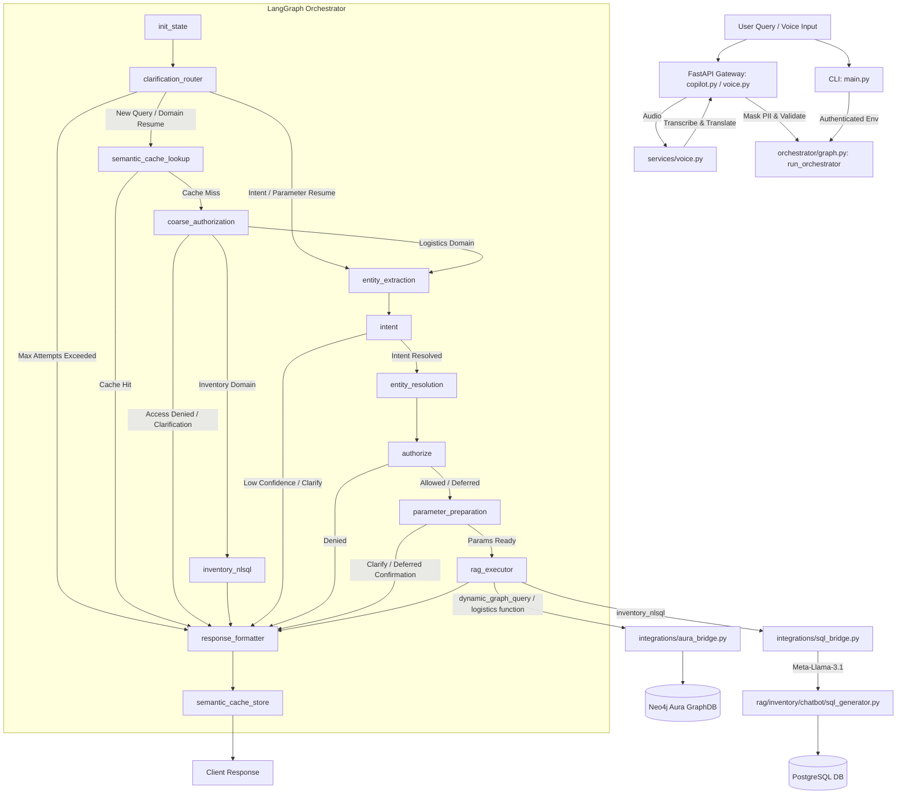

# IntelliSupply Orchestrator Pipeline Guide

This document outlines how the **IntelliSupply Orchestrator** works, starting from the entrypoints, tracing through every node in the LangGraph workflow, detailing the state transformations, and specifying which files call which other files for what purpose.

---

## 1. High-Level Orchestrator Architecture

The orchestrator is built on **LangGraph**. Its primary goal is to accept user inputs (voice or text), resolve the target domain (Inventory Postgres DB or Logistics Neo4j Aura GraphDB), perform RBAC and resource checks, extract and prepare parameters, query the database, and format a natural language response.

### Execution Flow Chart

---

## 2. File & Component Catalog

Below is a detailed breakdown of all files that make up and support the orchestration engine in the `agentic_ai/` directory.

### Core Orchestrator (`agentic_ai/orchestrator/`)
*   **[graph.py](file:///c:/Users/GauryJithesh/Desktop/aarushi/IntelliSupply/agentic_ai/orchestrator/graph.py):** Defines the LangGraph state machine, sets up the conditional routing logic, compiles the workflow, and exposes the entrypoint `run_orchestrator()`.
*   **[state.py](file:///c:/Users/GauryJithesh/Desktop/aarushi/IntelliSupply/agentic_ai/orchestrator/state.py):** Declares `AgentState`, a TypedDict representing the global state threaded through every node in the graph.
*   **[init_node.py](file:///c:/Users/GauryJithesh/Desktop/aarushi/IntelliSupply/agentic_ai/orchestrator/init_node.py):** Sets context variables, normalizes multilingual input, parses user identities, and initializes base state.
*   **[clarification_router_node.py](file:///c:/Users/GauryJithesh/Desktop/aarushi/IntelliSupply/agentic_ai/orchestrator/clarification_router_node.py):** Handles Human-in-the-Loop (HITL) resumption, detects active sessions, manages query merges, and enforces the clarification attempt cap.
*   **[semantic_cache_lookup_node.py](file:///c:/Users/GauryJithesh/Desktop/aarushi/IntelliSupply/agentic_ai/orchestrator/semantic_cache_lookup_node.py):** Orchestrator cache lookup node that intercepts new queries to serve cached responses on exact matches.
*   **[rbac_coarse.py](file:///c:/Users/GauryJithesh/Desktop/aarushi/IntelliSupply/agentic_ai/orchestrator/rbac_coarse.py):** Resolves coarse-level query routing via keywords and enforces role boundaries at the domain level.
*   **[entity_extraction_node.py](file:///c:/Users/GauryJithesh/Desktop/aarushi/IntelliSupply/agentic_ai/orchestrator/entity_extraction_node.py):** Extracts entity variables from logistics queries.
*   **[intent.py](file:///c:/Users/GauryJithesh/Desktop/aarushi/IntelliSupply/agentic_ai/orchestrator/intent.py):** Handles intent classifier routing, fallback detection, and clarification trigger logic.
*   **[intent_task_classifier.py](file:///c:/Users/GauryJithesh/Desktop/aarushi/IntelliSupply/agentic_ai/orchestrator/intent_task_classifier.py):** Standard system prompts, exemplars, LLM integration, and keyword fallbacks for logistics task classification.
*   **[intent_routing.py](file:///c:/Users/GauryJithesh/Desktop/aarushi/IntelliSupply/agentic_ai/orchestrator/intent_routing.py):** Dynamically restricts logistics candidates based on present entities (e.g. mapping `order_id` to `order_lookup`).
*   **[entity_resolution_node.py](file:///c:/Users/GauryJithesh/Desktop/aarushi/IntelliSupply/agentic_ai/orchestrator/entity_resolution_node.py):** Binds active courier identity and maps names/codes of hubs and couriers to database-internal UUIDs.
*   **[authorize_node.py](file:///c:/Users/GauryJithesh/Desktop/aarushi/IntelliSupply/agentic_ai/orchestrator/authorize_node.py):** Task-level authorization checks. Enforces ALLOW, DENY, or DEFER decisions post-intent.
*   **[parameter_preparation_node.py](file:///c:/Users/GauryJithesh/Desktop/aarushi/IntelliSupply/agentic_ai/orchestrator/parameter_preparation_node.py):** Validates query parameters and maps tasks to actual database methods (Aura functions) or handles deferred confirmation loops.
*   **[rag_executor.py](file:///c:/Users/GauryJithesh/Desktop/aarushi/IntelliSupply/agentic_ai/orchestrator/rag_executor.py):** Dispatches requests to the appropriate RAG database bridge.
*   **[response_formatter.py](file:///c:/Users/GauryJithesh/Desktop/aarushi/IntelliSupply/agentic_ai/orchestrator/response_formatter.py):** Constructs normalized JSON payloads returned to FastAPI or CLI.
*   **[answer_generation.py](file:///c:/Users/GauryJithesh/Desktop/aarushi/IntelliSupply/agentic_ai/orchestrator/answer_generation.py):** Invokes the LLM to format natural language answers for the user using query and returned records.
*   **[response_synthesis.py](file:///c:/Users/GauryJithesh/Desktop/aarushi/IntelliSupply/agentic_ai/orchestrator/response_synthesis.py):** Provides fallback answer text templates if the LLM generation layer fails.
*   **[result_normalizer.py](file:///c:/Users/GauryJithesh/Desktop/aarushi/IntelliSupply/agentic_ai/orchestrator/result_normalizer.py):** Reshapes raw database queries into structured data feeds before feeding them to LLM generation.
*   **[semantic_cache_store_node.py](file:///c:/Users/GauryJithesh/Desktop/aarushi/IntelliSupply/agentic_ai/orchestrator/semantic_cache_store_node.py):** Saves fully successful, authorized turns to Redis.
*   **[task_registry.py](file:///c:/Users/GauryJithesh/Desktop/aarushi/IntelliSupply/agentic_ai/orchestrator/task_registry.py):** Central dictionary mapping domains, task names, keywords, and role-task permission boundaries.
*   **[tracing.py](file:///c:/Users/GauryJithesh/Desktop/aarushi/IntelliSupply/agentic_ai/orchestrator/tracing.py):** Observability helper that wraps nodes to log entry/exit timing, state-diff logs, and trace events into `agentic_ai/app.log`.
*   **[rbac/courier_identity.py](file:///c:/Users/GauryJithesh/Desktop/aarushi/IntelliSupply/agentic_ai/orchestrator/rbac/courier_identity.py):** Resolves JWT auth claims to build courier-specific identities.
*   **[rbac/session_context.py](file:///c:/Users/GauryJithesh/Desktop/aarushi/IntelliSupply/agentic_ai/orchestrator/rbac/session_context.py):** Restores/merges session information across API cycles.
*   **[resource_rbac.py](file:///c:/Users/GauryJithesh/Desktop/aarushi/IntelliSupply/agentic_ai/orchestrator/resource_rbac.py):** Enforces resource-level constraints (e.g. confirming order ownership for couriers).
*   **[hitl_session.py](file:///c:/Users/GauryJithesh/Desktop/aarushi/IntelliSupply/agentic_ai/orchestrator/hitl_session.py):** Persists and clears Human-in-the-Loop clarification parameters in active session context structures.

### Integration Bridges (`agentic_ai/integrations/`)
*   **[sql_bridge.py](file:///c:/Users/GauryJithesh/Desktop/aarushi/IntelliSupply/agentic_ai/integrations/sql_bridge.py):** Executes safe read-only SQL commands generated from natural language prompts using Nvidia-hosted Meta-Llama-3.1 LLM.
*   **[aura_bridge.py](file:///c:/Users/GauryJithesh/Desktop/aarushi/IntelliSupply/agentic_ai/integrations/aura_bridge.py):** Dispatches logistics commands to Neo4j database functions or runs dynamic Cypher queries with security post-filters.
*   **[llm_client.py](file:///c:/Users/GauryJithesh/Desktop/aarushi/IntelliSupply/agentic_ai/integrations/llm_client.py):** Standardized OpenAI API client initialization using Nvidia-hosted endpoints.
*   **[language.py](file:///c:/Users/GauryJithesh/Desktop/aarushi/IntelliSupply/agentic_ai/integrations/language.py):** Detects non-English inputs via Hugging Face models and translates queries into English.

### Entity & Clarification Context (`agentic_ai/context/`)
*   **[entity_extractor.py](file:///c:/Users/GauryJithesh/Desktop/aarushi/IntelliSupply/agentic_ai/context/entity_extractor.py):** Extracts keywords, dates, and order IDs from queries using domain-specific regex patterns.
*   **[self_scoped.py](file:///c:/Users/GauryJithesh/Desktop/aarushi/IntelliSupply/agentic_ai/context/self_scoped.py):** Identifies first-person courier references (e.g. "my route") to mark them as `self_scoped`.
*   **[clarification_manager.py](file:///c:/Users/GauryJithesh/Desktop/aarushi/IntelliSupply/agentic_ai/context/clarification_manager.py):** Generates questions when clarifying user intent.

### Cache Backend (`agentic_ai/cache/`)
*   **[semantic_cache.py](file:///c:/Users/GauryJithesh/Desktop/aarushi/IntelliSupply/agentic_ai/cache/semantic_cache.py):** Manages key building, caching lookups, invalidation, and writes.
*   **[cache_service.py](file:///c:/Users/GauryJithesh/Desktop/aarushi/IntelliSupply/agentic_ai/cache/cache_service.py):** Interacts with Redis, implementing fail-open safeguards.

---

## 3. Step-by-Step Execution Sequence

Here is the exact file-to-file trace of a query as it runs through the system.

### Phase 1: Input Trigger & Ingestion

1. **User Input:**
   * **Voice Path:** The user uploads recorded audio. In [FastAPI/routers/voice.py](file:///c:/Users/GauryJithesh/Desktop/aarushi/IntelliSupply/FastAPI/routers/voice.py), the `transcribe` route parses the file and calls `transcribe_and_translate` in [FastAPI/services/voice.py](file:///c:/Users/GauryJithesh/Desktop/aarushi/IntelliSupply/FastAPI/services/voice.py).
     * The service converts the audio to standard WAV format using `ffmpeg`.
     * It sends the file to Hugging Face Whisper via `_call_whisper_transcribe`.
     * It detects the language using `detect_language` and translates to English using `translate_to_english` in [agentic_ai/integrations/language.py](file:///c:/Users/GauryJithesh/Desktop/aarushi/IntelliSupply/agentic_ai/integrations/language.py).
   * **Text Path:** The user sends a text query to the API at `/api/copilot/query`, handled by [FastAPI/routers/copilot.py](file:///c:/Users/GauryJithesh/Desktop/aarushi/IntelliSupply/FastAPI/routers/copilot.py), or types it into the CLI at [agentic_ai/main.py](file:///c:/Users/GauryJithesh/Desktop/aarushi/IntelliSupply/agentic_ai/main.py).

2. **Security Gateways (API only):**
   * The router in `copilot.py` invokes [FastAPI/security/pii.py](file:///c:/Users/GauryJithesh/Desktop/aarushi/IntelliSupply/FastAPI/security/pii.py) to mask sensitive data (emails, SSNs).
   * It calls [FastAPI/security/validation.py](file:///c:/Users/GauryJithesh/Desktop/aarushi/IntelliSupply/FastAPI/security/validation.py) to validate query length.
   * It calls [FastAPI/security/injection.py](file:///c:/Users/GauryJithesh/Desktop/aarushi/IntelliSupply/FastAPI/security/injection.py) to reject prompt injections.

3. **Orchestrator Ingestion:**
   * The router calls `run_orchestrator` in [agentic_ai/orchestrator/graph.py](file:///c:/Users/GauryJithesh/Desktop/aarushi/IntelliSupply/agentic_ai/orchestrator/graph.py), passing the sanitized query, user credentials, and active session buffers.

---

### Phase 2: LangGraph Node Execution Trace

#### Node 1: `init_state`
*   **Source File:** [agentic_ai/orchestrator/init_node.py](file:///c:/Users/GauryJithesh/Desktop/aarushi/IntelliSupply/agentic_ai/orchestrator/init_node.py)
*   **What it does:** Sets up initial agent state, maps roles, and normalizes queries.
*   **Calling Details:**
    *   Calls `normalize_query` in [agentic_ai/integrations/language.py](file:///c:/Users/GauryJithesh/Desktop/aarushi/IntelliSupply/agentic_ai/integrations/language.py) to detect non-English text and translate it.
    *   Calls `resolve_courier_identity` in [agentic_ai/orchestrator/rbac/courier_identity.py](file:///c:/Users/GauryJithesh/Desktop/aarushi/IntelliSupply/agentic_ai/orchestrator/rbac/courier_identity.py) to parse JWT token arguments.
    *   Calls `merge_logistics_session` and `restore_user_role` in [agentic_ai/orchestrator/rbac/session_context.py](file:///c:/Users/GauryJithesh/Desktop/aarushi/IntelliSupply/agentic_ai/orchestrator/rbac/session_context.py) to recover active user states.
*   **Output State:** Sets `user_query`, `original_query`, `detected_language`, `user_role`, and session buffers (`logistics_session`, `inventory_session`).

#### Node 2: `clarification_router`
*   **Source File:** [agentic_ai/orchestrator/clarification_router_node.py](file:///c:/Users/GauryJithesh/Desktop/aarushi/IntelliSupply/agentic_ai/orchestrator/clarification_router_node.py)
*   **What it does:** Determines if the current query is a fresh request or a clarification answer to a previous prompt.
*   **Calling Details:**
    *   Calls `get_active_hitl_session`, `attempts_exceeded`, and `clarification_stage` in [agentic_ai/orchestrator/hitl_session.py](file:///c:/Users/GauryJithesh/Desktop/aarushi/IntelliSupply/agentic_ai/orchestrator/hitl_session.py).
    *   *If Domain Resume:* Calls `parse_domain_answer` and `apply_domain_session_to_state` in [hitl_session.py](file:///c:/Users/GauryJithesh/Desktop/aarushi/IntelliSupply/agentic_ai/orchestrator/hitl_session.py) to route the resolved domain.
    *   *If Intent/Parameter Resume:* Restores saved task, domain, and entities, and merges the new clarification answer with the original query via `merge_intent_query`.
*   **Routing Logic:**
    *   If attempt cap (3 turns) is exceeded: route to `response_formatter`.
    *   If intent/parameter resume: route to `entity_extraction` (bypasses semantic cache).
    *   If brand-new query or domain resume: route to `semantic_cache_lookup`.

#### Node 3: `semantic_cache_lookup`
*   **Source File:** [agentic_ai/orchestrator/semantic_cache_lookup_node.py](file:///c:/Users/GauryJithesh/Desktop/aarushi/IntelliSupply/agentic_ai/orchestrator/semantic_cache_lookup_node.py)
*   **What it does:** Checks if an identical query exists in the role-scoped cache.
*   **Calling Details:**
    *   Calls `semantic_lookup` in [agentic_ai/cache/semantic_cache.py](file:///c:/Users/GauryJithesh/Desktop/aarushi/IntelliSupply/agentic_ai/cache/semantic_cache.py).
    *   `semantic_cache.py` builds the key using `build_cache_key` in [agentic_ai/cache/cache_key.py](file:///c:/Users/GauryJithesh/Desktop/aarushi/IntelliSupply/agentic_ai/cache/cache_key.py) and requests the payload from `cache_service.get`.
*   **Routing Logic:**
    *   If `cache_hit` is `True`: route directly to `response_formatter` (short-circuit).
    *   If `cache_hit` is `False`: route to `coarse_authorization`.

#### Node 4: `coarse_authorization`
*   **Source File:** [agentic_ai/orchestrator/rbac_coarse.py](file:///c:/Users/GauryJithesh/Desktop/aarushi/IntelliSupply/agentic_ai/orchestrator/rbac_coarse.py)
*   **What it does:** Decides domain (inventory vs logistics) and verifies domain access permissions.
*   **Calling Details:**
    *   Calls `match_coarse_domain_keywords` and `coarse_domain_from_matches` in [agentic_ai/orchestrator/task_registry.py](file:///c:/Users/GauryJithesh/Desktop/aarushi/IntelliSupply/agentic_ai/orchestrator/task_registry.py) to inspect queries for keyword markers.
    *   Calls `is_domain_allowed_for_role` to check user permission boundaries (e.g. `INVENTORY` role is barred from logistics, `COURIER` is barred from inventory).
    *   *If Ambiguous:* Invokes `ClarificationManager.domain_question()` in [agentic_ai/context/clarification_manager.py](file:///c:/Users/GauryJithesh/Desktop/aarushi/IntelliSupply/agentic_ai/context/clarification_manager.py) and serializes a clarification session.
*   **Routing Logic:**
    *   If clarification or authorization denial is triggered: route to `response_formatter`.
    *   If domain is resolved as `inventory`: route to `inventory_nlsql`.
    *   If domain is resolved as `logistics`: route to `entity_extraction`.

---

### Phase 3: Domain Routing Branches

#### Branch A: The Inventory Path (`inventory_nlsql` Node)
1. **Node Action:** Runs `inventory_nlsql_node` in [agentic_ai/orchestrator/graph.py](file:///c:/Users/GauryJithesh/Desktop/aarushi/IntelliSupply/agentic_ai/orchestrator/graph.py), setting the task to `"inventory_nlsql"` and confidence to `1.0`. It then executes the RAG node.
2. **RAG Execution:**
   * `rag_executor_node` calls `execute_rag` in [agentic_ai/orchestrator/rag_executor.py](file:///c:/Users/GauryJithesh/Desktop/aarushi/IntelliSupply/agentic_ai/orchestrator/rag_executor.py).
   * It directs the query to `ask_inventory_sql` in [agentic_ai/integrations/sql_bridge.py](file:///c:/Users/GauryJithesh/Desktop/aarushi/IntelliSupply/agentic_ai/integrations/sql_bridge.py).
   * `sql_bridge.py` dynamically loads the schema tables and imports `generate_sql` from [rag/inventory/chatbot/sql_generator.py](file:///c:/Users/GauryJithesh/Desktop/aarushi/IntelliSupply/rag/inventory/chatbot/sql_generator.py).
   * The generator prompts an NVIDIA-hosted Meta-Llama-3.1 LLM to create a PostgreSQL query.
   * `sql_bridge.py` runs `_validate_read_only_sql` to verify safety (blocking DDL operations like `DROP` or `DELETE`, and stacked queries).
   * It runs the SQL against Supabase Postgres via SQLAlchemy.
   * It forwards the fetched rows back to Meta-Llama-3.1 instructing it to compile a natural language response.
   * The response is saved in the state's `agent_response`.
3. **Downstream:** Routes to `response_formatter`.

---

#### Branch B: The Logistics Path

#### Node 5: `entity_extraction`
*   **Source File:** [agentic_ai/orchestrator/entity_extraction_node.py](file:///c:/Users/GauryJithesh/Desktop/aarushi/IntelliSupply/agentic_ai/orchestrator/entity_extraction_node.py)
*   **What it does:** Extracts logistics variables from the user's query.
*   **Calling Details:**
    *   Calls `EntityExtractor.extract` in [agentic_ai/context/entity_extractor.py](file:///c:/Users/GauryJithesh/Desktop/aarushi/IntelliSupply/agentic_ai/context/entity_extractor.py) to look for order IDs (`ORD123`), cities, courier names, delivery dates, or hub numbers using regex pattern sets.
    *   Calls `apply_self_scoped_entities` in [agentic_ai/context/self_scoped.py](file:///c:/Users/GauryJithesh/Desktop/aarushi/IntelliSupply/agentic_ai/context/self_scoped.py) to flag self-referencing phrases (e.g. "my route").
    *   Calls `merge_entities` in [agentic_ai/orchestrator/hitl_session.py](file:///c:/Users/GauryJithesh/Desktop/aarushi/IntelliSupply/agentic_ai/orchestrator/hitl_session.py) to combine current hits with previously cached entities.
*   **Routing Logic:** Always routes to `intent`.

#### Node 6: `intent`
*   **Source File:** [agentic_ai/orchestrator/intent.py](file:///c:/Users/GauryJithesh/Desktop/aarushi/IntelliSupply/agentic_ai/orchestrator/intent.py)
*   **What it does:** Decides which logistics task covers the user query.
*   **Calling Details:**
    *   Calls `classify_domain_task` in [agentic_ai/orchestrator/intent_task_classifier.py](file:///c:/Users/GauryJithesh/Desktop/aarushi/IntelliSupply/agentic_ai/orchestrator/intent_task_classifier.py).
    *   `intent_task_classifier.py` narrows potential task scopes using `narrow_candidate_tasks` in [agentic_ai/orchestrator/intent_routing.py](file:///c:/Users/GauryJithesh/Desktop/aarushi/IntelliSupply/agentic_ai/orchestrator/intent_routing.py).
    *   It sends queries to an OpenAI client targeting an Nvidia LLM using system templates (`INTENT_SYSTEM_PROMPT`) to classify the query.
    *   *If LLM fails:* Falls back to `_keyword_fallback_task` to resolve queries via keywords.
    *   *If Out of Scope:* Resolves task as `dynamic_graph_query` if the role has authorization to run arbitrary queries.
    *   *If Low Confidence:* Calls `build_clarification_question` and generates a parameter collection session.
*   **Routing Logic:**
    *   If intent clarification is needed (confidence < 0.70): route to `response_formatter`.
    *   If intent is successfully matched: route to `entity_resolution`.

#### Node 7: `entity_resolution`
*   **Source File:** [agentic_ai/orchestrator/entity_resolution_node.py](file:///c:/Users/GauryJithesh/Desktop/aarushi/IntelliSupply/agentic_ai/orchestrator/entity_resolution_node.py)
*   **What it does:** Resolves user-facing entity names and binds authenticated IDs.
*   **Calling Details:**
    *   Calls `apply_courier_identity_binding` to check if the user is a `COURIER`. If so, reads `authenticated_courier_id` (JWT claim) to set `bound_courier_id` on state, and binds it as the target `courier_id` if the query is `self_scoped`.
    *   If a courier name/reference is present: calls `resolve_courier` in [rag/aura_graphdb/aura_courier.py](file:///c:/Users/GauryJithesh/Desktop/aarushi/IntelliSupply/rag/aura_graphdb/aura_courier.py) to fetch the graph's internal `courier_id`.
    *   If a hub reference/name is present: calls `resolve_hub` in [rag/aura_graphdb/aura_hubs.py](file:///c:/Users/GauryJithesh/Desktop/aarushi/IntelliSupply/rag/aura_graphdb/aura_hubs.py) to get the canonical numeric `hub_id`.
*   **Routing Logic:** Always routes to `authorize`.

#### Node 8: `authorize`
*   **Source File:** [agentic_ai/orchestrator/authorize_node.py](file:///c:/Users/GauryJithesh/Desktop/aarushi/IntelliSupply/agentic_ai/orchestrator/authorize_node.py)
*   **What it does:** Enforces strict role-based access checks on logistics data.
*   **Calling Details:**
    *   Calls `authorize_task_and_resources` in [agentic_ai/orchestrator/resource_rbac.py](file:///c:/Users/GauryJithesh/Desktop/aarushi/IntelliSupply/agentic_ai/orchestrator/resource_rbac.py).
    *   *ADMIN:* Automatically allowed.
    *   *LOGISTICS / INVENTORY:* Allowed if task is enabled in `is_task_allowed`.
    *   *COURIER:* Centralized resource validation rules:
        *   Denies hub queries (`hub_route`, `delivery_days` or hub-scoped queries in dynamic tasks).
        *   For `order_lookup`: Calls `fetch_order_route` in [agentic_ai/integrations/aura_bridge.py](file:///c:/Users/GauryJithesh/Desktop/aarushi/IntelliSupply/agentic_ai/integrations/aura_bridge.py) (which calls `get_order_route` in [rag/aura_graphdb/aura_route_queries.py](file:///c:/Users/GauryJithesh/Desktop/aarushi/IntelliSupply/rag/aura_graphdb/aura_route_queries.py)) to fetch order details. It checks if the order's `assigned_courier_id` matches the user's `bound_courier_id`.
        *   For routes/orders: Denies if requested `courier_id` does not match `bound_courier_id`.
        *   For `dynamic_graph_query`: Evaluates scope. If no target entities are provided, it defers evaluation (`AUTHZ_DEFER`).
*   **Routing Logic:**
    *   If access is denied (`authorization_denied` is set): route to `response_formatter`.
    *   If allowed or deferred: route to `parameter_preparation`.

#### Node 9: `parameter_preparation`
*   **Source File:** [agentic_ai/orchestrator/parameter_preparation_node.py](file:///c:/Users/GauryJithesh/Desktop/aarushi/IntelliSupply/agentic_ai/orchestrator/parameter_preparation_node.py)
*   **What it does:** Ensures all parameters required to call database queries are present.
*   **Calling Details:**
    *   *If Dynamic Query and Auth is Deferred:* Sets up a confirmation prompt asking the courier "Do you want to see your own data for this request?" (setting `defer_reason` to `self_scope_confirmation` in the HITL session).
    *   *If Deterministic:* Calls `prepare_task_parameters`.
        *   Checks for missing required fields (e.g. `order_id` for order lookup, `courier_id` and `delivery_day` for routes, hub pairs for routes).
        *   If missing or unresolved entities exist, creates a parameter clarification session.
        *   Otherwise, maps the task to an Aura function name (e.g. `get_order_route`, `get_orders_for_courier_day`, `get_saved_courier_route`, `resolve_route_hubs`) and packs variables.
*   **Routing Logic:**
    *   If clarification or confirmation is required: route to `response_formatter`.
    *   If parameters are ready: route to `rag_executor`.

#### Node 10: `rag_executor`
*   **Source File:** [agentic_ai/orchestrator/rag_executor.py](file:///c:/Users/GauryJithesh/Desktop/aarushi/IntelliSupply/agentic_ai/orchestrator/rag_executor.py)
*   **What it does:** Executes query against Neo4j Aura GraphDB.
*   **Calling Details:**
    *   *If Dynamic Graph Query:* Calls `execute_dynamic_cypher` in [agentic_ai/integrations/aura_bridge.py](file:///c:/Users/GauryJithesh/Desktop/aarushi/IntelliSupply/agentic_ai/integrations/aura_bridge.py). This imports `run_dynamic_cypher` from [rag/aura_graphdb/aura_dynamic_cypher.py](file:///c:/Users/GauryJithesh/Desktop/aarushi/IntelliSupply/rag/aura_graphdb/aura_dynamic_cypher.py) (read-only query generator + executor) and returns rows.
    *   *If Deterministic:* Calls `execute_aura_function` in [agentic_ai/integrations/aura_bridge.py](file:///c:/Users/GauryJithesh/Desktop/aarushi/IntelliSupply/agentic_ai/integrations/aura_bridge.py).
    *   `aura_bridge.py` dispatches to query methods in [rag/aura_graphdb/aura_route_queries.py](file:///c:/Users/GauryJithesh/Desktop/aarushi/IntelliSupply/rag/aura_graphdb/aura_route_queries.py) or [rag/aura_graphdb/aura_hubs.py](file:///c:/Users/GauryJithesh/Desktop/aarushi/IntelliSupply/rag/aura_graphdb/aura_hubs.py) (e.g. `get_saved_courier_route`, `resolve_hub`, etc.) which connect to Neo4j using `aura_connection.py`.
    *   It saves the raw database records into the state's `agent_response`.
*   **Routing Logic:** Always routes to `response_formatter`.

---

### Phase 4: Final Formatting & Cache Storage

#### Node 11: `response_formatter`
*   **Source File:** [agentic_ai/orchestrator/response_formatter.py](file:///c:/Users/GauryJithesh/Desktop/aarushi/IntelliSupply/agentic_ai/orchestrator/response_formatter.py)
*   **What it does:** Serializes final results and generates user-facing answers.
*   **Calling Details:**
    *   *If cache hit:* Bypasses formatting and directly yields the cached response verbatim.
    *   *If success:* Calls `_generate_graph_answer` to compile the user response.
        *   Reshapes raw data using `normalize_result_for_answer` in [agentic_ai/orchestrator/result_normalizer.py](file:///c:/Users/GauryJithesh/Desktop/aarushi/IntelliSupply/agentic_ai/orchestrator/result_normalizer.py).
        *   Attempts to prompt the LLM to write a friendly natural language response via `generate_answer` in [agentic_ai/orchestrator/answer_generation.py](file:///c:/Users/GauryJithesh/Desktop/aarushi/IntelliSupply/agentic_ai/orchestrator/answer_generation.py).
        *   *If LLM fails or result is empty:* Reverts to rule-based response generation templates in [agentic_ai/orchestrator/response_synthesis.py](file:///c:/Users/GauryJithesh/Desktop/aarushi/IntelliSupply/agentic_ai/orchestrator/response_synthesis.py) to guarantee a response.
    *   If a terminal status is output: calls `clear_all_hitl_sessions` in [agentic_ai/orchestrator/hitl_session.py](file:///c:/Users/GauryJithesh/Desktop/aarushi/IntelliSupply/agentic_ai/orchestrator/hitl_session.py) to scrub active session variables.
    *   Constructs the unified JSON response envelope.
*   **Routing Logic:** Always routes to `semantic_cache_store`.

#### Node 12: `semantic_cache_store`
*   **Source File:** [agentic_ai/orchestrator/semantic_cache_store_node.py](file:///c:/Users/GauryJithesh/Desktop/aarushi/IntelliSupply/agentic_ai/orchestrator/semantic_cache_store_node.py)
*   **What it does:** Saves successful responses to cache.
*   **Calling Details:**
    *   Checks if the query is a clean, successful, non-cached, and fully-authorized execution turn.
    *   Calls `semantic_store` in [agentic_ai/cache/semantic_cache.py](file:///c:/Users/GauryJithesh/Desktop/aarushi/IntelliSupply/agentic_ai/cache/semantic_cache.py) to save the payload to Redis.
*   **Routing Logic:** Completes the graph execution (`END`).
